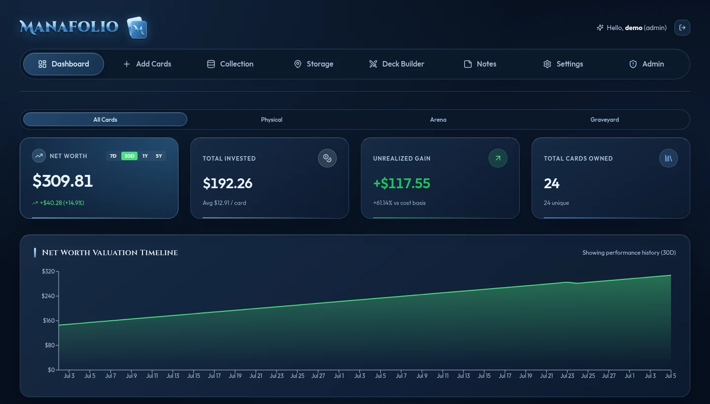
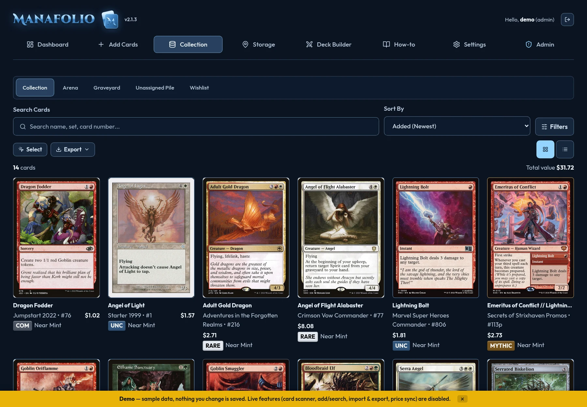
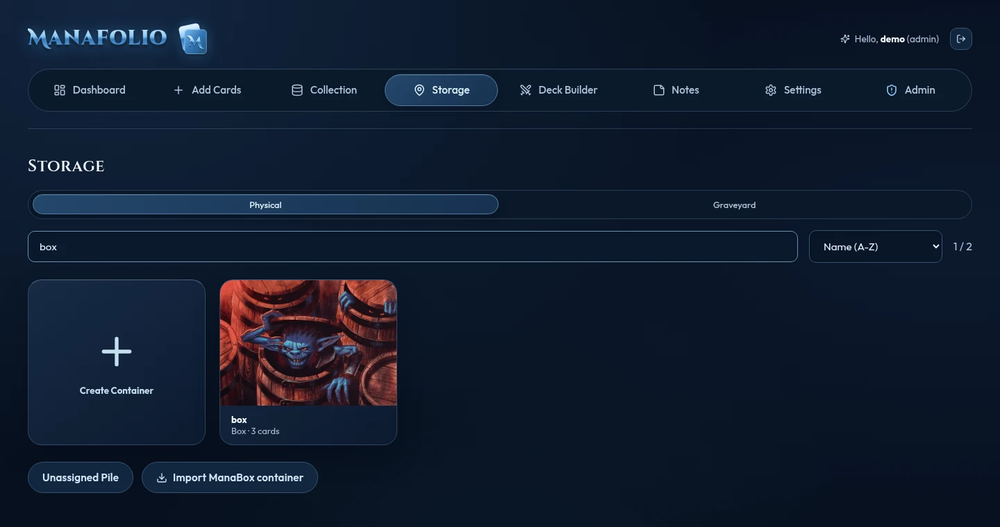
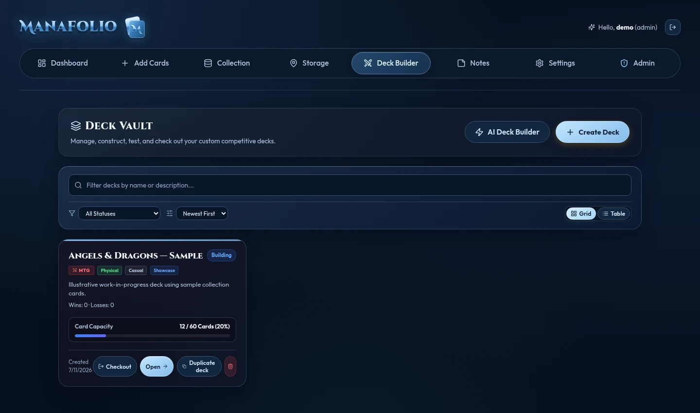
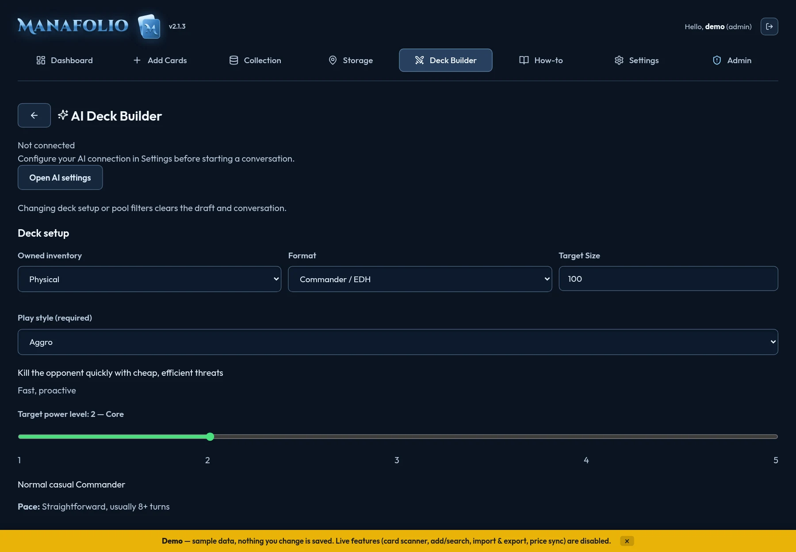

<div align="center">


# Manafolio

**Magic collection, storage, and decks on your own server.**

Self-hosted collection, storage, and deck manager for Magic: The Gathering.

[Install](#install) · [User Guide](docs/USER_GUIDE.md) · [Features](#features) · [Workflows](#workflows) · [Architecture](PROJECT.md) · [MIT License](LICENSE)

</div>

Manafolio brings your Magic collection, physical storage, and decks together on a server you control. Keep exact printings and purchase records, find the box holding a copy, reserve cards for a night of play, and manage Arena inventory without mixing it with physical ownership.

For step-by-step instructions, inventory explanations, backup warnings, and troubleshooting, open **How-to** in the app (**More → How-to** on a phone), or read the [Manafolio help and how-to guide](docs/USER_GUIDE.md). The in-app page includes full-guide search and chapter navigation; guide text is currently English.

Manafolio was originally forked from [Bindarr](https://github.com/thenotoriousJeremy/bindarr) version 1.8.5, created by **thenotoriousJeremy and contributors**.

## Features

- **Four inventory destinations.** Track Physical and Arena copies separately, plan purchases in Wishlist, and archive cards in Graveyard without deleting their quantities or metadata. Wishlist and Graveyard do not inflate owned totals; archived cards supply only Graveyard deck definitions, never Physical or Arena decks.
- **Collection detail.** Search Scryfall, track printing, finish, language, condition, purchase price and graded slabs, and mark copies Missing/Found without losing their last known locations. Filter, sort, stack duplicates, and switch between grid and table views.
- **Dashboard.** Compare All Cards, Physical, and Arena quantities, value, recorded costs, collection growth, color identity, mana value, and saved deck performance. Graveyard has its own archived-card view. Accessible chart-data tables expose the underlying numbers.
- **Physical storage.** Organize binders and boxes by page, row, and slot. Find unfiled cards in Unassigned Pile; move or auto-file copies, expand capacity, lock compartments, and choose card-art covers for containers. Graveyard containers keep archived storage separate.
- **Deck building and play.** Create Physical or Arena decks, import lists and precons, select a commander, inspect mana curves and rules, simulate draws, and track wins/losses. Physical checkout reserves copies and creates a storage-aware pull list; Pulled status helps gather cards. Related tokens show ownership and physical locations.
- **Import, export, and backup.** Review CSV and ManaBox imports, export the current collection view or decklists, and move an account with a complete JSON backup. Automatic SQLite snapshots support server-level recovery.
- **Optional AI.** Use your own ChatGPT/Codex account, Gemini or OpenRouter API key, or an Ollama service for inventory-aware suggestions and deck improvements. Review and edit drafts before saving; the collection and deck workflows do not require AI.
- **Your own server.** Multi-user accounts, roles, invite-only registration by default, read-only API keys, optional public shares, account themes, and translated interfaces. Access the same server from desktop and phone browsers.
- **Mana-inspired themes.** Arcane Blue and Jenny remain available alongside Plains, Island, Swamp, Mountain, Forest, and Wastes palettes. Each retains layered surfaces, metallic branding, and desktop/mobile navigation. Choose your account theme in Settings; removed Light, Magic, and LCARS selections fall back to Arcane Blue.
- **Camera scanning.** Identify artwork candidates with local models and title/footer OCR, then save them to an account-scoped Scan review queue. Toggle foil or discard drafts before explicitly adding them to your collection; scanning needs additional server assets and HTTPS on phones.

## At a glance

| What you want to do | Where to start |
| --- | --- |
| Bring in an existing collection | Add Cards: CSV or ManaBox import with review before saving |
| Find a card you own | Collection filters, then its storage location in the inspector |
| Prepare a deck for play | Deck Builder: save, check out, and follow the pull list |
| Keep records without counting cards as owned | Graveyard inventory and archived containers |
| Move or recover account data | Settings: complete JSON backup; protect server-volume backups separately |

The application uses React, Express, and SQLite. It runs as one Docker service or from source; there is no required hosted Manafolio account or AI subscription.

## Screenshots

These screenshots use bundled **sample data**, not a personal collection. Names, quantities, prices, history, and deck records are illustrative; the demo does not save changes, and camera scanning requires a server installation.

### Dashboard

An overview of your collection, its value, and inventory breakdowns.



### Collection

Browse printings and manage your cards across inventory views.



### Storage

Find cards through artwork-covered containers and their physical layouts.



### Deck Builder

Organize decks and see which inventory supplies them.



### AI Deck Builder

Choose inventory filters, deck archetype, format, target size, and power level before starting a conversation. This screenshot shows demo setup options; live AI requests are disabled in the demo.



## Install

### Docker

Clone [the Manafolio repository](https://github.com/batman-2099/manafolio) and build the checked-in Compose service:

```bash
git clone https://github.com/batman-2099/manafolio.git
cd manafolio
docker compose up -d --build
```

Open `http://localhost:3001`. Without `DEFAULT_ADMIN_PASSWORD`, the first browser visit creates the owner account; protect access until setup is complete. With it set, startup creates the `admin` account when no users exist, and the first visit is a regular login. Registration is invite-only unless explicitly enabled.

The `manafolio-data` volume contains the SQLite database, automatic backups, TLS material, scan models, and catalogs. Configure optional variables in the Compose service's environment; [`.env.example`](.env.example) documents available settings. Builds use local source, not an assumed published image or binary. After updating your checkout, run `docker compose up -d --build` again. Existing installations must follow the migration instructions first.

### Migrate an existing installation

Manafolio uses its own database, deployment, browser, and backup names. Startup does not rename previous database files or migrate deployment volumes, browser state, or backup formats. Follow the offline procedure before starting the new service. **Do not start the new service against an empty replacement volume.**

1. Record the current `DB_PATH`, Compose project/volume names, and persistent-data location. Stop every service that can write to the database, then make an offline backup of the entire data directory outside the deployment. Keep the original volume until migration is verified.
2. With all writers stopped, rename the collection database to `manafolio.db` and any matching `-wal` and `-shm` sidecars to `manafolio.db-wal` and `manafolio.db-shm`. Keep them together; never discard a WAL that may contain committed data or overwrite an existing destination.
3. Rename `<previous-DB_PATH>.scryfall-bulk.sqlite` to `manafolio.db.scryfall-bulk.sqlite` in the same directory, including matching sidecars. This rebuildable catalog is not the collection database.
4. Update `.env`, service definitions, external scripts, and mounts. Docker uses `/app/database/manafolio.db`; source defaults to `backend/database/manafolio.db`. Copy the stopped persistent volume's complete contents into the new `manafolio-data` volume, preserving ownership, permissions, backups, TLS material, models, catalogs, and account credentials. Compose project names affect actual volume names: inspect the resolved mount rather than assuming it.
5. Rebuild and restart. Verify accounts, collection quantities, storage, decks, and backups before retiring the old deployment. If a populated installation shows owner creation, stop and correct the mount or `DB_PATH`; do not initialize a replacement collection.

Very old databases containing the `sub_location_1` schema take a destructive legacy migration path that drops collection and location tables. Preserve a verified offline copy and review `backend/src/db.js` before starting Manafolio against such a database.

Browser keys use `manafolio_*`: sign in again and reselect browser-only preferences; old keys are not migrated. Older compatible JSON exports need the explicit [backup format conversion](#back-up-or-move-an-account) before restore.

### HTTP, HTTPS, and reverse proxies

| Port | Use |
| --- | --- |
| `3001` | Localhost or a reverse proxy that terminates TLS. |
| `3443` | Direct HTTPS, including camera use from a phone. |

Use HTTPS for remote access. The built-in self-signed certificate is generated in the persistent volume; browsers require explicit acceptance per device. Set `SSL_CERT_PATH` and `SSL_KEY_PATH` to use a trusted certificate. Behind a TLS-terminating reverse proxy, set `TRUST_PROXY=1` and usually publish only port `3001`.

### Configuration

The canonical list is [`.env.example`](.env.example).

| Variable | Purpose |
| --- | --- |
| `DB_PATH` | SQLite database path; Docker uses `/app/database/manafolio.db`. |
| `DEFAULT_ADMIN_PASSWORD` | Bootstrap `admin` password only when no users exist. |
| `PUBLIC_BASE_URL` | External URL for share links and an allowed CORS origin. |
| `TRUST_PROXY` | Reverse-proxy hop count, commonly `1`. |
| `HTTPS_PORT` | Built-in HTTPS port; empty for HTTP-only operation. |
| `SSL_CERT_PATH` / `SSL_KEY_PATH` | Trusted TLS certificate and key. |
| `ALLOW_REGISTRATION` | `true` enables public self-registration. |
| `CV_MODEL_DIR` | Persistent scan models and catalogs. |
| `BACKUP_INTERVAL_HOURS` / `BACKUP_KEEP_LAST` | Automatic SQLite snapshot schedule and retention. |
| `OLLAMA_BASE_URL` | Default Ollama service address; users may choose their own. |

### Phone browsers

Open your server's HTTPS address in your phone's browser and sign in with your server account. The responsive web interface includes collection, storage, decks, and [camera scanning](#card-scanning); scanning requires browser camera permission and the server-side assets described below. Manafolio is web-only, with no packaged Android or iOS clients.

## Workflows

### Add physical, Arena, or wishlist cards

Open **Add Cards → Search & Add**, search by name, set, or collector number, and choose the exact printing and destination. Rapid Add supports collector-number entry with a pinned set. The card inspector edits condition, language, value, slab details, and storage placement, and can duplicate eligible raw physical copies.

Archive individual cards or a selection to **Graveyard** to retain their metadata without counting them as owned. Return checked-out copies first. Individual archiving clears physical placement; restore explicitly to Physical Collection or Arena, with physical restores returning to Unassigned Pile. Whole-container transfers preserve placement instead.

### Import ManaBox collection exports

In **Add Cards**, upload a ManaBox `.txt` export or a CSV, including Manafolio-style and MTG Arena collection exports. Choose the destination inventory before importing. TXT previews quantities, foil entries, and distinct printings; CSV review shows detected rows, validation errors, and editable column mappings before saving. Printings resolve through the local Scryfall catalog with API fallback.

The **Import activity** log reports lookups, rate-limit waits, preparation, and saving; completion summaries include failures and downloadable retry lists. Preparation is not a committed save. Leaving the page disconnects the log but does not roll back the import—check the destination before retrying after a lost connection.

### Export the current collection view

Choose **Export view CSV** or **Export view TXT** in Collection. Export includes all matching results, not just the current page, respecting the inventory tab, search, filters, sorting, and duplicate stacking. It excludes hidden cards and other tabs. CSV includes printing, condition, language, and purchase price; TXT uses quantity, name, set, and collector number. Use a complete backup for the whole account.

### Create and import decks

1. Open **Deck Builder → Create Deck** and choose **Physical**, **Arena**, or **Graveyard** inventory.
2. Build from cards in that inventory or import a plain, ManaBox, or MTG Arena-style decklist, such as `4 Llanowar Elves (FDN) 227`. Creation can include unowned cards in all three inventories; missing-copy counts still use only the matching inventory. No owned copies are created.
3. Review your draft and choose **Save**, immediately before **Draw Simulator**. Card additions/removals, quantities, Pulled status, commander, and applied properties are committed together. Imports and edits remain local until saved; an unsaved marker and leave confirmation protect the draft, and failed saves retain it for retry.

**Edit Properties → Deck Type → Graveyard → Apply Properties → Save** archives a deck definition without moving its cards. Its notes, list, and metadata remain; physical source preferences are cleared. Return checked-out decks first. Restoring to Physical or Arena requires the destination inventory to own every required copy. Graveyard decks cannot check out or use AI improvement. **Duplicate deck** retains inventory and metadata, not checkout state or wins/losses.

Commander / EDH and Brawl support one **Commander** toggle; selecting another replaces it. The card inspector's **Create Commander Deck** starts a 100-card-target deck with that card as commander, using its inventory, without moving or checking out copies. Review format legality yourself.

Below Description, one summary panel groups **Supertype Breakdown**, **Color & Land Distribution**, **Containers needed**, and **Deck Health & Rules**. Color-coded, labeled bars show exact counts with lengths relative to the deck's total card count; multicolor cards can contribute to more than one color. The panel stacks on phones, and win/loss controls remain in Deck Health.

Under Wins and Losses, **Sleeved** records **None**, **Single**, **Double**, or **Triple** for that deck. Changes save immediately without saving or discarding other deck edits; the selection is retained in deck duplicates and complete account backups.

Click the **card back** beneath the commander to preview a solid sleeve color or upload a PNG, JPEG, or WebP image. **Save** stores that deck's choice independently of other edits; **Cancel** leaves it unchanged, and the default option restores the Magic card back. Custom images are resized, kept with the deck in the database, and preserved in duplicates and complete account backups.

You can also enter a direct **Image URL** and choose **Load image** before saving. The browser downloads and resizes a copy; your server does not fetch arbitrary URLs. If the image host blocks cross-origin downloads, download the file yourself and use the upload option.

For Physical decks, **Containers needed** beneath **Supertype Breakdown** lists each source container and the number of copies to gather, including Unassigned Pile and a count of unavailable copies. It uses the saved deck's pull-list plan (reserved locations when checked out); save draft changes to refresh the list. Arena decks do not show physical containers.

### Check out a physical deck

Save first, then choose **Check Out for Play**. Manafolio reserves the copies and creates a pull list grouped by container and compartment while retaining their stored positions. Other decks show unavailable quantities and the reserving deck's name. Mark cards **Pulled** as you gather them; sorting by **Pulled status** puts not-yet-pulled cards first.

Return the deck to release reservations before changing its card composition, individually archiving its reserved copies, or reusing them for another checkout. Whole-container archiving preserves existing reservations. Arena has separate ownership and no physical checkout or storage flow.

### Find tokens for a card or deck

Open **Related tokens** in the card inspector or **Tokens** below a deck's cards; AI drafts have the same grid. Tiles show artwork, inventory-scoped ownership, physical locations (including Unassigned Pile), and **Created by** links to the relevant cards.

Ownership matches names case-insensitively, including double-faced tokens' front names. Decks prefer matches from the commander's set or corresponding token set, then fall back to any set within their inventory. Same-named tokens with different rules or stats can match: check artwork and text. Wishlist does not count; Graveyard token ownership is separate from Physical and Arena.

Tokens are references, not additions to the deck: they do not change size, reserve copies, or enter deck exports. Scryfall supplies relations; failed lookups offer retry. No related tokens found does not prove a card cannot create copies or variable tokens.

### Import a Magic preconstructed deck

Open **Add Cards → Precon Deck**, search MTGJSON by name, set code, or type, and inspect the contents. **Create Storage Container** and **Create Deck** are both enabled by default. The first creates a sized Deck Box; the second creates a Physical deck containing all imported cards and checks it out. Disable either if unwanted. With deck creation selected, unresolved cards or import failure leave no partial collection, container, or deck.

### Import a ManaBox storage container

Storage opens a searchable, sortable gallery. Create a container, choose its cover through **Container Settings → Choose container image**, and organize cards by layout or image list. Move selections between containers or back to Unsorted, or use automatic filing. Capacity is advisory: cards stay in the chosen eligible container even when full, and Storage marks containers/pages/rows **Over limit**. Add pages/rows or change capacity manually to match your physical storage.

Choose **Import ManaBox container** and upload a `.txt` export. This creates a box named after the file and files matching, already-owned physical copies from Unsorted into its first row—it does not create missing collection cards.

Expand **Full summary** for requested, moved, and remaining quantities. **Move** fills remaining quantities from eligible copies in unlocked containers or Unsorted, without moving the same copies twice on retry. Matching uses exact printing identity and may use another finish while preserving the actual copy's metadata. Missing, Arena, and Wishlist copies stay put. Checked-out copies may change storage assignments without changing reservations. The imported box and first row must remain unlocked and unrestricted, with custom sorting and stacking disabled.

In an unlocked container, select cards and use **Add to Deck…** to add quantities to an existing deck without moving them, or **Archive to Graveyard** after returning any checked-out copies.

### Create a deck from a storage container

Open a Physical or Graveyard container and choose **Create Deck**. This uses its complete saved contents, not the current filters or selection, combining printing quantities and setting the target size to the full count. The deck uses the container's inventory. Missing and checked-out copies may be included in the definition, even from a locked container.

The container and reservations stay unchanged; the deck is **not checked out**. Review its format, size, and commander. Physical decks must resolve missing or reserved copies before checkout; Graveyard decks cannot check out. Empty containers cannot supply this workflow.

### Store archived cards in Graveyard containers

Open **Collection → Graveyard → Graveyard containers**, or select **Graveyard** in Storage. Archived inventory has separate containers, unassigned cards, layouts, capacity, locks, and covers, with the same filing controls.

A container's **More → Move to Graveyard / Restore to Collection** transfers it and all contents atomically, retaining quantities, metadata, positions, layout, settings, and cover. Unlock the container and compartments first. Cards may remain in decks, including checked-out decks: deck lists, checkout state, and exact-copy reservations are preserved. Archived copies do not supply owned totals or new checkouts. Individual restores clear archived placement; whole-container restores preserve it. Deleting an archived container leaves its cards archived and unassigned. Graveyard containers can supply Graveyard deck definitions, but not physical imports, Physical/Arena decks, AI inventory, or public container shares.

### Get an AI deck recommendation

AI is optional. In **Settings → AI preferences**, choose and save a provider and model:

- **ChatGPT:** connect your own account through OpenAI's device verification flow; it needs Codex access and may require enabling device-code authorization in ChatGPT security settings. Choose a model and its supported thinking level.
- **Ollama:** run [Ollama](https://docs.ollama.com/) and install a structured-output model, for example `ollama pull granite4.1:8b`. Enter the service's HTTP(S) address, check the connection, and choose an installed model. A blank address uses `OLLAMA_BASE_URL` (default `http://127.0.0.1:11434`). Models are not downloaded automatically, and failures never fall back to ChatGPT.
- **Gemini:** create an API key in [Google AI Studio](https://aistudio.google.com/apikey), select Gemini, save the key, then choose and save an available model. Free-tier quotas and availability depend on your account and model; Google's free-tier data-use terms apply.
- **OpenRouter:** create an [OpenRouter API key](https://openrouter.ai/settings/keys), select OpenRouter, save the key, then choose and save a structured-output model. Free models are subject to availability and quotas; other models can charge your account. Manafolio does not switch to another model on failure.

Open **Deck Builder → AI Deck Builder**, select inventory, format, and target size, then choose one **Deck type** under **Deck setup**. Its explanation and play style appear below the selector and accompany requests to your AI provider. Describe a deck or ask a question. Filter eligible cards by color, set, and, for Physical, containers. Missing physical copies are excluded. **Include checked-out cards** allows planning with reserved copies, not sharing or releasing their reservations.

Set **Target power level** from **1 — Exhibition** through **5 — cEDH**; it defaults to **2 — Core**. These Commander-oriented descriptions are goals, not certified ratings or guaranteed turn counts. The AI tries to match the target within your owned cards and selected format and explains when the pool cannot support it.

Discuss and edit the suggested draft, then explicitly choose **Add Deck**. Questions do not replace the draft. Conversation is session-only; leaving cancels an active request, and changing inventory or filters clears the draft and conversation. Request logs show progress, not private model reasoning.

For a saved deck, save editor changes before **Improve with AI**. **Save Deck** replaces its name, description, cards, and commander while preserving identity, results, and settings; **Save as New Deck** creates a separate unchecked-out deck. Return a checked-out source before replacing it. Eligible source-deck copies remain available despite filters and their own reservation, but other decks' reservations still apply unless explicitly included for planning.

Every generated or improved draft includes an editable **Strategy** with its game plan, opening-hand guidance, play sequencing, synergies, and win conditions. Saving a new deck puts the strategy in **Notes**. Saving an improvement appends it to existing notes without overwriting them; an identical strategy already at the end is not appended again.

Saving rechecks ownership, quantities, copy limits, and cached rules atomically; failed saves leave existing data unchanged. No AI save moves cards or checks out a deck. Suggestions are not guaranteed tournament legal: cached rules may be incomplete or stale, and partner commanders and sideboards are not supported. Oversized inventories and incomplete or invalid responses are rejected rather than silently trimmed or partially saved; narrow filters or increase Ollama's model context when needed.

**Data sharing and credentials.** Requests send eligible card metadata/counts, the session conversation, and the current draft—including manually edited draft descriptions and strategies—to the chosen provider. They do not send storage locations, container names/IDs, saved private notes, or other users' collections. Source-deck context excludes its saved description and private notes. ChatGPT sends data to OpenAI and uses your Codex limits; an Ollama service may process data locally or remotely depending on its configuration.

Connect only to a trusted Manafolio server. The official [Codex app-server](https://developers.openai.com/codex/app-server/) integration requires a Unix server, including Docker, and disables model access to host files, commands, and external tools. Credentials are separated per user under `<database-directory>/codex/<user-id>/`, but administrators can access them. **Disconnect** removes that user's local Codex data. Collection JSON backups exclude credentials; whole-volume backups include them and must be protected. AI endpoints require browser sessions rather than API keys.

Gemini and OpenRouter keys are stored separately per user and provider in the server database, not returned to the browser. **Remove API key** deletes that provider's stored key without affecting other providers; revoke it at the provider to invalidate it externally. Administrators and database/volume backups can access these keys; account JSON exports exclude them. Gemini receives requests at Google's API, while OpenRouter forwards them to the selected model's upstream provider. Review both the gateway's and upstream provider's policies before sending data. Adding providers does not change existing saved provider choices.

**Ollama deployment security.** Requests originate from the server, not the browser. Signed-in users can contact server-accessible HTTP(S) addresses, including localhost and private/LAN services. Invite only trusted users and enforce outbound network restrictions with your firewall; URL validation is not an access allowlist. Manafolio does not add Ollama authentication. Do not expose its port publicly.

In Docker, `127.0.0.1` is the container. To reach host Ollama, use `OLLAMA_BASE_URL=http://host.docker.internal:11434` and, on Linux, add `extra_hosts: ["host.docker.internal:host-gateway"]` to the Compose service. Configure Ollama's `OLLAMA_HOST` to listen on an interface reachable from the container, with firewall restrictions. Alternatively use an Ollama service name on a shared Docker network.

### Back up or move an account

Use **Settings → Collection Backup & Data Options → Export Complete Backup**. The JSON includes collection entries, cached metadata, storage layouts and placements (including Graveyard), decks, commander selections, and deck results. Restore **replaces the signed-in account's collection, storage, and decks** after confirmation; it is not a merge or a server-credential backup.

Only Magic integrations are supported. Records from removed integrations are not deleted or relabeled, and account exports retain them. Restore rejects backups containing unsupported game identities, or attempts to replace unsupported records already in the account, before changing account data. Preserve original backups for use with a compatible older deployment; do not change card IDs or game fields to force a restore.

Restore accepts only the top-level format `manafolio-backup`. For an older compatible export, keep the original outside the deployment, make a copy, and change only that copy's top-level `format` to `manafolio-backup`. Leave its version and data intact: this is a marker conversion, not a schema upgrade or permission to relabel arbitrary JSON. Restore still validates compatibility.

For server recovery, preserve the persistent volume and keep protected backups outside it; snapshots in the same volume do not protect against losing that volume. Stop database writers before an offline whole-volume copy, retaining the database and any WAL/SHM files together. Whole-volume backups may include account credentials and TLS private keys.

## Card scanning

**Add Cards → Scan Cards** uses local ONNX artwork matching, informational title OCR, and footer OCR to verify set code and collector number. It requires a server installation, models, a catalog, and native Tesseract with English data.

1. Fetch models after deployment:

   ```bash
   docker exec manafolio node scripts/fetch-models.mjs
   ```

   From source, run `node scripts/fetch-models.mjs` in `backend/`.
2. Build the relevant language catalog under **Admin → Catalogs**. Downloading data and fingerprinting artwork can take hours; stopped builds retain completed work for resuming.
3. Source installations need Tesseract at `/usr/bin/tesseract`, the path used by the scanner, with `eng` trained data (`/usr/bin/tesseract --list-langs`). On Debian/Ubuntu, install `tesseract-ocr tesseract-ocr-eng`. Source-built Docker images include both.

Hold the card still until verification finishes. Auto-queue, including Turbo, requires two fresh photos to agree on the printing and pass safety checks. Settings changes, pausing, or leaving cancel pending verification. Native camera zoom is available only when supported by the browser/device; no simulated digital crop is applied.

Automatic and manually selected scans go to **Scan review**, not directly to owned inventory. Drafts survive refreshes and remain outside collection totals, storage, and decks until you choose **Add to Collection**. Selecting a candidate queues one Near Mint, non-foil copy immediately, using the resolved language and market price as purchase price; no second details screen appears. Use **Foil** to toggle a draft's finish, or **Discard** to remove a mistaken match and scan it again. Collection exports and account JSON backups omit these temporary drafts; full database backups retain them.

Similar printings, glare, blur, catalog gaps, and conflicting footer OCR can require manual review. Set/language filters narrow candidates but do not prove a match. Missing or failed footer OCR blocks automatic queuing; unreadable footer text supplies no corroborating evidence but is not, by itself, an unconditional block—the artwork and ambiguity checks still apply. Title OCR is informational: it is never compared against artwork candidates or used to allow or block automatic queuing. Title recognition uses the existing English OCR engine; non-English text, long names, sleeves, and unusual layouts may remain unreadable. These checks do not detect condition or foil, and accuracy depends on lighting and focus.

The results dialog shows the actual OCR reading, including low-confidence text marked **uncertain**. “No readable name” means OCR supplied no title text, not merely that its confidence was low. All title readings are informational.

Phones require HTTPS. See [the image-identification pipeline](PROJECT.md#image-identification-pipeline) for details and limitations.

## Dashboard analytics

- **Collection growth** groups current quantities of retained owned records by their original addition month over the last 12 UTC calendar months. It is not an immutable acquisition ledger: quantity edits affect earlier months and deleted records disappear.
- **Deck performance** uses saved wins/losses, games, and win rate, scoped to inventory. No games means no win rate; fewer than 10 games carries a low-sample caution. These counters do not record opponents, matchups, or match dates.
- **Color identity / mana value** compare owned copies with saved deck-slot quantities. A copy represented in multiple decks counts in each; multicolor cards count in each identity color. Mana charts exclude lands, separate zero from unknown, and group values of 7 or more.
- **Graveyard** shows archived quantities, value, costs, and history separately. Its growth uses original addition dates, not archive dates; history values currently archived cards, not historical archive membership. It omits deck-performance comparisons.

Expand **View chart data** for exact values. Older servers or demo fixtures without analytics show an unavailable state rather than invented statistics.

## Magic data, pricing, and languages

Scryfall supplies cards, sets, artwork, printings, and prices. Manafolio retains exact printings and languages. The interface supports English, Brazilian Portuguese, French, German, Italian, Japanese, Korean, Russian, Simplified Chinese, Traditional Chinese, and Spanish.

Collection, deck, precon, and container imports consult a persistent Scryfall bulk catalog first, with API fallback for unresolved printings. Administrators control its daily UTC refresh under **Settings → Scryfall bulk data** (10:00 UTC by default), or use **Download now**. A missing catalog warms in the background; imports do not wait for it. Scheduled checks download changed snapshots; manual download forces a refresh.

The separate `<DB_PATH>.scryfall-bulk.sqlite` file is rebuildable card data, not a collection backup. Allow space for it and a temporary replacement; failed updates retain the previous catalog. Imported prices initially reflect the snapshot, while scheduled price sweeps and stale-cache refreshes use the live API.

Prices come from the printing's provider, primarily Scryfall, TCGplayer, and Cardmarket. Manafolio does not convert currencies; mixed-currency totals are identified as mixed. A graded copy's per-copy value replaces its raw market price in totals and exports.

## API access

Create a read-only key in **Settings → API Keys** and pass it as a Bearer token:

```bash
curl -H "Authorization: Bearer <key>" http://localhost:3001/api/stats/networth
```

Keys authorize only `GET` requests and cannot access admin endpoints. Useful routes include `/api/stats/networth` for valuation, `/api/stats` for dashboard data, and `/api/collection` for collection entries. The unauthenticated `/api/health` returns `{"status":"ok"}`.

## Development

Node 18.20+ and npm 9+ are required; use Node 20 for server/container parity. Shared JSON uses native import attributes.

```bash
npm run install:all
npm run dev
```

Frontend: `https://localhost:5173`. Backend: `http://localhost:3001`.

Run the full test set:

```bash
npm test
```

Frontend quality gates:

```bash
cd frontend
npm run lint
npm run check:locales
npm run build
```

Architecture, route ordering, database conventions, and contributor guidance are in [PROJECT.md](PROJECT.md) and [AGENTS.md](AGENTS.md).

## Translating

Copy [`frontend/src/locales/en.json`](frontend/src/locales/en.json), translate values, and open a pull request. Missing keys fall back to English; preserve placeholders and plural forms. See [docs/TRANSLATING.md](docs/TRANSLATING.md).

## Acknowledgments and license

Manafolio began as a fork of **Bindarr**, by **thenotoriousJeremy and contributors**, based on upstream **1.8.5**. Thank you for the foundation.

[MIT](LICENSE)
