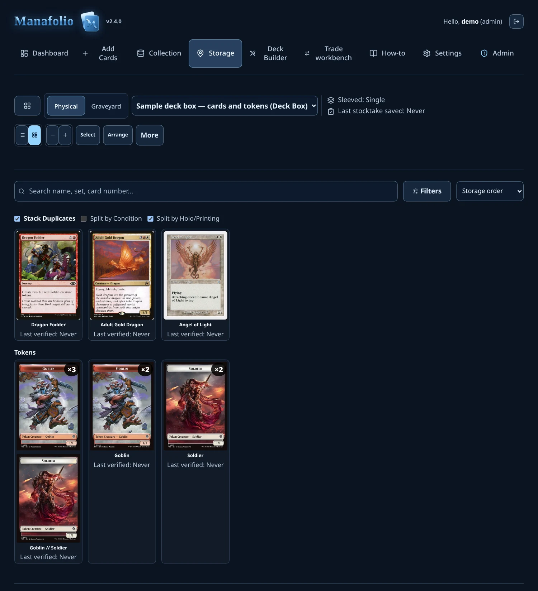

<div align="center">


# Manafolio

**Magic collection, storage, and decks on your own server.**

[Install](#install) · [User guide](docs/USER_GUIDE.md) · [Screenshots](#screenshots) · [Documentation](#documentation) · [Get help](#help-and-contributing)

</div>

Manafolio is a self-hosted, multi-user collection, storage, and deck manager for **Magic: The Gathering**. Track exact printings, find the box holding a copy, and prepare decks for play without mixing physical ownership with Arena inventory.

Built with React, Express, and SQLite, it runs as a desktop app on Linux, macOS, and Windows, as one Docker service, or from source. The web interface also works in desktop and phone browsers. No hosted Manafolio account or AI subscription is required.

## Install

### Desktop apps

Download the package for your platform from [GitHub Releases](https://github.com/batman-2099/manafolio/releases). Each desktop app includes its own window and bundled server; no separate Node.js installation or browser is needed.

| Platform | Download |
| --- | --- |
| **Linux x86-64** — Ubuntu 22.04 or compatible newer desktop distributions | [`Manafolio-linux-x64.AppImage`](https://github.com/batman-2099/manafolio/releases/latest/download/Manafolio-linux-x64.AppImage) |
| **macOS 14.4+ on Apple Silicon** | [`Manafolio-macos-arm64.dmg`](https://github.com/batman-2099/manafolio/releases/latest/download/Manafolio-macos-arm64.dmg) |
| **macOS 14.4+ on Intel x86-64** | [`Manafolio-macos-x64.dmg`](https://github.com/batman-2099/manafolio/releases/latest/download/Manafolio-macos-x64.dmg) |
| **Windows 10+ x64** | [`Manafolio-Setup-windows-x64.exe`](https://github.com/batman-2099/manafolio/releases/latest/download/Manafolio-Setup-windows-x64.exe) |

**Install and launch**

- **Linux:** Make it executable with `chmod +x Manafolio-linux-x64.AppImage`, then open it. See [Linux requirements and FUSE troubleshooting](docs/INSTALLATION.md#linux-appimage).
- **macOS:** Open the DMG, drag **Manafolio.app** to **Applications**, then launch it. See [macOS installation](docs/INSTALLATION.md#macos-dmg).
- **Windows:** Run Setup, then open **Manafolio** from the Start Menu. Installs for the current user without administrator privileges; a desktop shortcut is optional. See [Windows installation](docs/INSTALLATION.md#windows-installer).

**Security notices:** the Windows installer is unsigned, and the macOS app is not Developer ID signed or notarized, so SmartScreen or Gatekeeper may warn. Download only from a trusted source and follow the platform-specific instructions above; do not disable system protections globally. On Linux, run as a normal user with Chromium's sandbox enabled.

**Your data stays separate from the app.** Quit Manafolio and back up its data directory before updating; finish imports and saves before quitting. Existing Docker or server-archive data is **not imported automatically**—follow the [migration guide](docs/INSTALLATION.md#migrate-an-existing-installation).

**Scanning and AI prerequisites:** Scan models/catalogs and native OCR prerequisites are not bundled; see [scanning setup](docs/INSTALLATION.md#card-scanning). On Windows, use Docker for native scanning/OCR and ChatGPT/Codex.

#### Allow Manafolio to open on macOS

The current macOS app is not Developer ID signed or notarized. Only follow these steps if you downloaded it from this project's [GitHub Releases](https://github.com/batman-2099/manafolio/releases) and trust the download:

1. Open the DMG for your Mac: `Manafolio-macos-arm64.dmg` for Apple Silicon or `Manafolio-macos-x64.dmg` for Intel. Drag **Manafolio.app** into **Applications**, and eject the DMG.
2. Open **Manafolio** from **Applications** once. If macOS says the developer cannot be verified or Apple cannot check the app for malicious software, dismiss the alert.
3. Open **Apple menu → System Settings → Privacy & Security**, scroll to **Security**, and click **Open Anyway** for Manafolio.
4. Authenticate if prompted, then click **Open** in the confirmation dialog. macOS saves an exception for this app; subsequent launches normally work from **Applications**.

Do not disable Gatekeeper globally or bypass an alert that the app **will damage your computer** or **is damaged**. Stop and investigate those warnings instead. On a managed Mac, your administrator may restrict exceptions. See [Apple's instructions for safely opening apps](https://support.apple.com/en-us/102445).

### Docker

For a **new installation**, install Docker with Compose, then run:

```bash
git clone https://github.com/batman-2099/manafolio.git
cd manafolio
docker compose up -d --build
```

Open **http://localhost:3001**. Without `DEFAULT_ADMIN_PASSWORD`, the first browser visit creates the owner account; **protect access until setup is complete**. With that variable set, startup creates `admin` when no users exist and the first visit shows login. Registration is invite-only unless explicitly enabled.

The `manafolio-data` volume holds the database, backups, TLS material, scan models, and catalogs. Keep protected backups outside that volume. Use **HTTPS for remote access and phone scanning**.

**Existing installation?** Read the [offline migration procedure](docs/INSTALLATION.md#migrate-an-existing-installation) before starting a renamed or moved deployment. Back up the stopped data directory first; very old `sub_location_1` schemas are rejected without dropping their tables and require an explicit migration. An unexpected owner-creation screen means you should stop and check the volume mount and `DB_PATH`, not initialize a replacement collection.

See the [installation guide](docs/INSTALLATION.md) for updates, configuration, HTTPS/reverse proxies, phone access, and scanning assets. Available environment variables are documented in [`.env.example`](.env.example).

## Features

- **Separate inventories:** Physical and Arena collections, Wishlist acquisition plans, and Graveyard archives. Wishlist and Graveyard do not inflate owned totals.
- **Collection management:** Search exact printings, track condition, finish, language, purchase prices, and graded slabs; check set completion and estimated value.
- **Physical storage:** Organize boxes and binders by page, row, and slot; group containers into storage units, print QR labels, and reconcile copies with Take Stock.
- **Deck building and play:** Import lists and precons, including supplied tokens with known quantities and explicitly selected verified token editions; tokens stay separate from playable deck totals. Choose commanders, simulate draws, track results, compare revisions, and reserve physical copies with storage-aware pull lists.
- **Planning and trading:** Combine deck shortfalls into a Shopping List, add confirmed deficits to Wishlist, and review both sides of a Physical inventory exchange.
- **Import, export, and recovery:** Review collection imports, export filtered views or decklists, and create complete account backups and server snapshots.
- **Scanning and price checks:** Identify printing candidates with local models and OCR. Review scans before adding inventory, or check prices without adding cards. Requires [server scan setup](docs/INSTALLATION.md#card-scanning).
- **Optional AI:** Use your own ChatGPT/Codex account, Gemini or OpenRouter key, or Ollama service; review and edit suggestions before saving.
- **Your own server:** Multi-user accounts, invite-only registration by default, read-only API keys, opt-in public shares, account themes, translated interfaces, and opt-in text-only offline collection lookup.

<details>
<summary>Double-sided tokens and storage rules</summary>

- **[Double-sided tokens](docs/USER_GUIDE.md#track-a-double-sided-token):** Choose a reverse from any set when adding a token, or leave an unknown/blank back unpaired. A unique collector-number match selects the reverse automatically. Search either face and see both images in card details and container galleries, while tracking one physical quantity, storage location, and checkout allocation. Cards from Token/Tokens sets are recognized as tokens even without token type metadata.
- **[Tokens in storage](docs/USER_GUIDE.md#capacity-stacking-and-locks):** Container galleries give tokens their own section. Deck Boxes exclude tokens from card totals and over-limit warnings; other container types still count them. Tokens remain selectable and included in Take Stock.

</details>

## Screenshots

### Dashboard

Collection totals, valuation, and inventory breakdowns.


### Deck Builder

Deck definitions and the inventory supplying them.


<details>
<summary>More screenshots: collection, storage, tokens, trading, card backs, and AI</summary>

### Collection


### Storage


### Tokens inside a container

Tokens have their own section, with a paired token's front and reverse shown together as one item. This screenshot uses **sample data and an illustrative pairing**, not a personal collection.



### Trade workbench

Build both sides of an exchange, then adjust selected quantities before review. This snapshot uses **sample data**, not a personal collection or a completed trade.


### Customize card back

Preview a sleeve design, solid color, or custom image before saving it for your deck.


### AI Deck Builder

Choose inventory filters, format, play style, and target power level. Live AI requests are disabled in the demo.


</details>

## Documentation

| Guide | What it covers |
| --- | --- |
| [Installation and administration](docs/INSTALLATION.md) | Desktop installers, Docker, upgrades/migration, configuration, HTTPS, native SSO, scanning assets, and Ollama deployment |
| [User guide](docs/USER_GUIDE.md) | Collection, storage, decks, trading, shopping, scanning, AI, sharing, and troubleshooting |
| [Backup and restore](docs/USER_GUIDE.md#back-up-restore-or-move-account-data) | Complete account exports, destructive restore warnings, and format compatibility |
| [Server backups](docs/USER_GUIDE.md#take-a-server-backup) | SQLite snapshots and offline whole-volume recovery precautions |
| [Offline collection lookup](docs/USER_GUIDE.md#look-up-your-collection-without-your-server) | Opt-in setup, trusted-device requirements, and read-only limits |
| [Dashboard analytics](docs/USER_GUIDE.md#what-the-numbers-mean) | What the charts count and how to interpret them |
| [API access](PROJECT.md#api-access) | Read-only keys, example requests, and health checks |
| [Architecture and development](PROJECT.md) | Components, data model, security boundaries, and verification commands |
| [Privacy](PRIVACY.md) | Stored data, external services, credentials, and operator responsibilities |

The user guide is also available under **How-to** in the app (**More → How-to** on a phone), with full-guide search and chapter navigation. Guide text is currently English. Returning after an update? Start with [recent workflow changes](docs/USER_GUIDE.md#catch-up-with-recent-changes).

## Help and contributing

Start with [troubleshooting](docs/USER_GUIDE.md#troubleshooting). For bugs or feature requests, use the [issue tracker](https://github.com/batman-2099/manafolio/issues). Include your version, browser/device, reproduction steps, and relevant errors—never credentials or private collection exports. For account or hosting problems, contact your server administrator.

Contributions are welcome through pull requests. Read the [contributor guide](AGENTS.md) and [architecture guide](PROJECT.md) before changing application behavior.

### Development

Use a currently supported Node LTS release, at least Node 22.12, and npm 9+. Docker, desktop server packaging, and CI use Node 22. Node 20 is no longer supported. Shared JSON uses native import attributes.

```bash
npm run install:all
npm run dev
```

Frontend: `https://localhost:5173`. Backend: `http://localhost:3001`.

Run `npm test` from the repository root. Before submitting frontend changes, also run `npm run lint --prefix frontend`, `npm run check:locales --prefix frontend`, and `npm run build:frontend`. See [development and verification](PROJECT.md#development-and-verification) for command details.

### Translating

Follow the [translation guide](docs/TRANSLATING.md) to add or update a language. Start from [`en.json`](frontend/src/locales/en.json), preserve placeholders and plural forms, and submit a pull request. Missing keys fall back to English.

## Acknowledgments and license

Manafolio began as a fork of [Bindarr](https://github.com/thenotoriousJeremy/bindarr), by **thenotoriousJeremy and contributors**, based on upstream **1.8.5**. Thank you for the foundation.

Licensed under the [MIT License](LICENSE).
