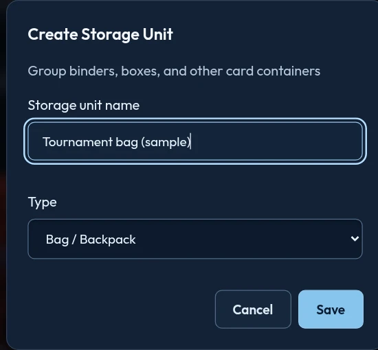

# Manafolio help and how-to guide

A practical guide to managing a Magic: The Gathering collection, finding physical cards, and preparing decks in Manafolio. Instructions use the English interface; translated labels may differ. Open **How-to** in the app, or **More → How-to** on a phone, to read this guide without leaving Manafolio.

**Using a demonstration site?** Demo cards are sample data. The demo is not a place to maintain your collection: changes are not reliably saved, and live search, importing, scanning, and provider features require a server installation.

For installation and upgrades, use the [README](../README.md#install). For how your data is handled, read [Privacy](../PRIVACY.md). For implementation details, see [Architecture](../PROJECT.md).

## Contents

- [Start here](#start-here)
- [Understand your inventories](#understand-your-inventories)
- [Read the Dashboard](#read-the-dashboard)
- [Add Cards: build an accurate inventory](#add-cards-build-an-accurate-inventory)
- [Collection: find, inspect, and export cards](#collection-find-inspect-and-export-cards)
- [Storage: keep the app and the cards on your shelf in sync](#storage-keep-the-app-and-the-cards-on-your-shelf-in-sync)
- [Build and manage decks](#build-and-manage-decks)
- [Optional AI deck help](#optional-ai-deck-help)
- [Settings and preferences](#settings-and-preferences)
- [Sharing and security](#sharing-and-security)
- [Back up, restore, or move account data](#back-up-restore-or-move-account-data)
- [Keep private Notes](#keep-private-notes)
- [Administrator essentials](#administrator-essentials)
- [Troubleshooting](#troubleshooting)
- [Further reference](#further-reference)

## Start here

### Use this guide in the app

Search for a feature or action using **Search the guide**, then open a matching chapter. Search checks the complete guide, not just the current chapter. Use the chapter list on desktop or the **Chapters** selector on a phone to browse. **In this chapter** jumps to a particular procedure; **Previous chapter** and **Next chapter** continue through the guide.

The guide text is currently English. Tables scroll horizontally on narrow screens; keyboard users can focus a table and use the arrow keys. Supporting documentation links open separately. The guide is bundled with your installed app, so reading chapters does not contact an external documentation service.

### Your first session

1. Open the address supplied by your server administrator. On a phone, use the server's HTTPS address—not `localhost`, which means the phone itself.
2. Sign in with your account on that server. A new installation without a bootstrap password offers owner-account creation; an existing installation should show login instead.
3. Complete the setup wizard if offered. Scanning and optional provider credentials can be configured later; manual collection management does not require them.
4. In **Settings → Preferences**, choose your interface language, theme, and preferred views.
5. Add a small, known batch of cards before importing an entire collection. Check exact printings, quantities, language, finish, and destination.
6. Create a storage container if you are organizing physical cards. You can create a deck before owning its cards; resolve missing Physical copies before checkout.
7. Download a complete account backup after checking your initial data.

**Unexpected owner-creation screen after an upgrade?** Stop. Do not create a replacement account. Ask the administrator to check the database path and persistent-volume mount against the [migration procedure](../README.md#migrate-an-existing-installation).

### Where to go

| Area | Use it for |
| --- | --- |
| Dashboard | Quantities, valuation, growth, deck-result summaries, and scan-only Price Check. |
| Add Cards | Search, rapid entry, collection imports, preconstructed decks, and camera scanning. |
| Collection | Find and inspect owned, planned, or archived cards; filter and export results. |
| Storage | Physical and archived containers, positions, covers, and moving copies. |
| Deck Builder | Deck drafts, private deck notes, imports, commander selection, checkout, results, and draw simulation. |
| How-to | Searchable chapters and step-by-step instructions from this guide. |
| Settings | Preferences, sharing, security, API access, AI configuration, and account backup/restore. |
| Admin | Administrator-only account, instance, backup, and catalog management. |

On narrow screens, use **More** for navigation items that are not shown in the bottom bar. The same server account works on desktop and phone. Device-specific preferences can differ between browsers.

## Understand your inventories

| Inventory | Meaning | Supplies owned totals/decks? | Physical placement? |
| --- | --- | --- | --- |
| Physical Collection | Paper cards you own. | Yes, for Physical workflows; availability still depends on missing/reserved status. | Yes. |
| Arena | Digital cards recorded separately. | Yes, for Arena workflows only. | No. |
| Wishlist | Cards you plan to acquire. | No. | Not an owned physical supply. |
| Graveyard | Archived records retained for reference. | Graveyard deck definitions only; no owned totals or Physical/Arena supply. | Separate Graveyard containers. |

- **Printing** means the particular set and collector number, not merely the card name. Finish, language, condition, and grading can distinguish your copies further.
- **Unassigned Pile / Unsorted** means physical copies without a storage assignment. It is not an extra purchase list.
- **Missing** retains the record but identifies a copy you cannot currently locate. Do not assume every stored record is available for play.
- **Checked out** means a Physical deck has reserved copies. It is not another inventory and does not erase their storage positions.
- **Archive** retains records outside owned supply. **Delete** is not an archive operation and should not be used when you intend to restore a card later.

**Example:** Owning four paper Lightning Bolts does not supply four Arena copies. Wishlisting another copy does not make a fifth available. If a Physical deck reserves the available copies, another deck may still describe the same cards but cannot check out those same copies simultaneously.

## Read the Dashboard

1. Choose the relevant inventory scope before comparing totals.
2. Read owned quantities and valuation separately from purchase cost. An estimated market value is not a guaranteed sale price.
3. Use the history-range controls for valuation trends.
4. Expand **View chart data** where provided to read exact values without relying on chart colors.
5. If analytics are unavailable, confirm the server version and whether you are on a demo; an unavailable panel is not a zero-valued collection.

### What the numbers mean

- Collection growth uses current quantities of retained owned records, grouped by original addition month over the last 12 UTC calendar months. Editing or deleting old entries can change earlier months; this is not a permanent transaction ledger.
- Deck performance uses manually saved wins and losses. No recorded games means no win rate; fewer than ten games is a small sample. Match dates, opponents, and matchups are not a match-history feature.
- Ownership-versus-deck comparisons count saved deck slots. A card used in multiple deck definitions appears in each, so deck-slot totals can exceed available physical copies.
- Multicolor cards contribute to each applicable identity color. Mana-value charts exclude lands, distinguish zero from unknown, and group values of seven or more.
- Graveyard figures describe archived records separately. Original addition dates are not archive dates, and history is not a reconstruction of past archive membership.
- Prices depend on printing and provider data. A graded copy's per-copy value can replace its raw market value. Manafolio does not convert currencies; mixed-currency totals must not be read as a converted single-currency sum.

### Check a card's price without adding it

1. On **Dashboard**, choose **Price Check**, immediately after **Add Cards**.
2. Activate the camera and scan the card using the usual scanner controls. A known set filter helps narrow the matches.
3. Compare the artwork, set, collector number, and language with your physical card. If recognition is uncertain, choose the correct candidate or printing before relying on its price.
4. Read the available normal and foil prices in their reported currency. The browser currency preference is used only when a quote has no recognized currency; it never converts amounts. Cached and provider prices are estimates, not offers or guaranteed sale prices; an unavailable price does not mean zero.
5. Scan another card, or choose **Back to Dashboard** to return to your previous inventory filter and history range.

**Price Check does not add owned inventory or create, edit, clear, or commit Scan review drafts.** To record a card you own, leave Price Check and use **Add Cards**. Camera permissions, HTTPS requirements, and scanner catalog setup are the same as ordinary scanning; the static demo cannot perform live recognition or provider lookups.

## Add Cards: build an accurate inventory

Start with the printing, not just the card name. Two copies of the same Magic card can have different sets, collector numbers, languages, finishes, and prices. Compare the result with the card in your hand before saving.

### Choose the right destination

- **Collection** is your physical inventory. New, unfiled physical cards appear in **Unassigned Pile**; Storage also calls this **Unsorted**.
- **Arena** is a separate digital inventory. Arena copies have no physical storage placement.
- **Wishlist** records cards you want, not copies you own.
- **Graveyard** preserves archived records without counting them as owned. Add a card through the usual workflow, then archive it if needed; it is not a scanner destination.

The **Add cards to** selector in **Search & Add** chooses **Collection** (physical) or **Arena** for single-card additions, bulk additions, Rapid add, and collection-file imports. Set it before choosing an import file. It does not turn Precon Deck or Scan Cards into Arena-import workflows.

### Add a card by searching

1. Open **Add Cards → Search & Add**.
2. Enter a name in **Card name**, or use **Card number (optional)** with a set code. Choose **Language** for the printing you are looking for—not the interface language.
3. Use **Sets (optional, comma-separated)** to narrow the search, for example `fdn`, or multiple comma-separated set codes. The suggestions can help identify the correct set.
4. Choose **Search cards**. Open a result; a search with exactly one result can open its add form directly. Compare the artwork, set, collector number, and language.
5. In **Add Card to Collection**, set **Quantity**, **Purchase Price**, **Condition**, **Printing**, and **Language**. Use the grading fields if this is a slab; leave the grader as raw for an ordinary card.
6. Choose **Add to Collection** or **Add to Arena**, matching your selected destination, or **Add to Wishlist** if you do not own it yet.
7. Open Collection in the corresponding inventory and check the new entry. Physical additions are initially unassigned; moving them is a separate step.

**Expected result:** a saved entry for the chosen printing and destination, with the quantity and copy details you supplied.

Changing the language in an add form can resolve a different printing, rather than merely relabeling the same card. Recheck the artwork and identification after changing it. Finish and condition are choices you make; the application does not inspect a card to determine them.

**If you cannot find a card:** check the language, set code, collector number, and result filters. Use a broader name search if a tightly scoped search fails. A **Card API Unavailable** message concerns the upstream card service; retry later rather than adding a similar-looking printing as a substitute.

### Rapid add: work through one set by collector number

Rapid add is useful when you have a pile from one known set and do not want to reopen the add form for every card.

1. In **Search & Add**, enter one set code in the set field and choose the search language.
2. Choose the destination in **Add cards to**.
3. Choose **Rapid add**. The button changes to **Rapid add on**.
4. Check the condition, printing/finish, and **Copies added per Enter**. These settings apply to subsequent rapid additions.
5. Type a collector number in **Card number, then Enter** and press Enter.
6. If the lookup identifies one printing, it saves immediately and clears the number field for the next card. If several printings match, pick the correct result instead of assuming one was added.
7. Review **Added this session** as you work. It shows the latest rapid additions and offers **Undo**; check Collection after correcting an addition, especially when you entered multiple copies.

**Warning:** Enter is a save action, not just a search. Verify the set and copy count before the first number, and update the set before starting a different pile.

**If it refuses to add:** **Enter a set code first** means the pinned set is missing. **No card #… in …** means the number was not found in that set; check suffixes, alternate treatments, and whether the card belongs to a supplemental set.

### Import a collection file

Use this workflow when you want to **add inventory**. It is different from **Storage → Import ManaBox container**, which moves copies you already own.

#### ManaBox text export

1. Open **Add Cards → Search & Add**.
2. Choose **Collection** or **Arena** in **Add cards to** before selecting the file.
3. Under **Import cards**, choose **Choose .txt file** and select your ManaBox `.txt` export.
4. Read **ManaBox Import Summary**. Check **Cards**, **Normal**, **Foils**, and the number of distinct printings.
5. Choose **Commit import**, or **Cancel** to leave without importing.
6. Watch **Import activity (latest 200 events)**, then review **Import Complete**.
7. Check the destination inventory, and use **Download failed cards** if failures are listed.

#### CSV, including Manafolio-style and Arena collection exports

1. Choose the destination in **Add cards to**, then choose **Choose CSV File** under **Import cards**.
2. In **CSV Import Review**, verify **Destination**, **Cards**, and **Copies**.
3. Under **Match CSV columns**, check the mapping for card name, quantity, set code, collector number, condition, printing/foil, language, purchase price, and card ID. Select **Not used** for an irrelevant column.
4. Choose **Update preview** after changing the mappings. Read and correct **Errors**; importing is disabled while the preview reports errors.
5. Choose **Import CSV** only when the preview is satisfactory.
6. Review **Import Complete**, including **Cards added** and **Cards not added**. Download the failed-card list where offered, correct those entries, and retry only the unresolved work.

**Expected result:** successfully resolved cards are added to the destination inventory. Reading a file and reviewing its preview do not save inventory by themselves.

Quantities must be whole numbers from 1 to 2,147,483,647. Missing quantities default to one; malformed, fractional, zero, or negative values are reported as errors rather than silently changed.

**Important import warning:** lookup/preparation is not the same as saving. Leaving the page disconnects the activity log but does not roll back a server import already in progress. There are no automatic import retries. After a lost connection, inspect the destination before submitting the same file again; repeating a successful import can add unwanted copies.

### Add cards from a published preconstructed product

1. Open **Add Cards → Precon Deck**.
2. Search by deck name, set code, or type using at least two characters, then choose **Search decks**.
3. Choose **More details** on the matching product and inspect the listed contents.
4. Review **Create Storage Container** and **Create Deck**. Both start enabled. Turn either off if you do not want that additional result.
5. Choose **Add deck** and confirm the prompt to add all cards.
6. Check Collection and, if requested, the new storage container.

This workflow adds the published main-board, commander, and sideboard cards to **physical Collection**. **Create Storage Container** creates a sized Deck Box. **Create Deck** also creates a Physical deck and checks it out, reserving the imported cards; disable it if you only want collection records. With deck creation selected, an unresolved card or import failure leaves no partial collection/container/deck from that operation.

**Warning:** this imports copies, rather than merely recording that you own a product. Do not import it again to inspect its contents; use **More details** instead.

### Optional: add a graded slab

1. Open **Add Cards → Graded Slab**.
2. Enter the certification number from the slab and choose **Look Up**.
3. Compare the returned grading information and candidate printings with the slab label and enclosed card.
4. Choose **This One** for the correct printing.
5. Open its inspector to record purchase price, a value for that copy, notes, or storage.

PSA lookup requires a configured PSA integration. The certificate number is sent to PSA through your server. If lookup is unavailable or no matching candidate appears, use **Search & Add** and enter grading details manually. A raw-card market estimate is not an appraisal of the slab.

### Scan physical cards with a camera

Scanning helps identify a printing; it does **not** determine condition, foil/finish, or a slab's grade. Exact-printing verification is heuristic, so check cards with reprinted artwork, difficult footers, sleeves, glare, or unusual treatments particularly carefully.

The scanner displays upper-left title OCR separately from artwork candidates, including low-confidence text marked **uncertain**, or “No readable name” when no title text is available. This reading is informational: it is never compared against artwork candidates or used to allow or block automatic queuing. Artwork, footer, reprint, image-quality, catalog, and two-photo safety checks still apply. The English OCR engine may not reliably read non-English names or unusual title layouts.

1. Open **Add Cards → Scan Cards** and choose **Activate Camera**. Allow browser camera access.
2. Use the **Auto-queue matches** toggle below the camera, above **Filter by set**. It is available before camera activation and remembers your choice. Green means on: qualifying matches are saved to Scan review. Off lets you review a single confirmed match before queuing. Choosing from **Identified Cards Found** always queues the selected card immediately. Neither setting adds cards directly to your collection.
3. Open **Scan settings** with the gear button to choose **Card language**. When you know the sets, use **Filter by set** below the camera on the main scan page. Set symbols appear beside set names when available. The filter is available before activating the camera; the gear menu is not needed. Set families can include related subsets; expand the choices when you need to narrow them further.
   Using a set filter is highly recommended when you know the sets you are scanning.
4. Place one card within the guide in even lighting. Keep the name, artwork, and footer readable, reduce sleeve reflections, and hold the card still while identification and verification run. The camera begins scanning automatically; there is no separate manual shutter button.
5. Check the identified card's name, set, number, artwork, and language. In **Identified Cards Found**, select the correct card to queue it immediately without a second details screen. This queues one Near Mint, non-foil copy with the resolved language and market price as purchase price. Use the manual search field or **Rescan / Try Again** when the suggestions are wrong. A failed save keeps the candidate list open for retry.
6. If the scanner opens **Review scanned card** for a single confirmed match, set quantity, purchase price, condition, printing, and language, then choose **Queue for review**. Candidate selections skip this form.
7. Remove the queued card before presenting the next one. Each card in **Scan review** has a **Foil** toggle and **Discard** button. Foil switches the whole draft's quantity between foil and non-foil without changing its card identity or other details; the highlighted button means foil. Discard a wrong match and scan it again. Discarding a draft does not touch your collection.
   To discard the whole reviewed batch, choose **Clear** and confirm. This removes only the drafts shown when you clicked Clear, not owned collection cards or newly queued scans.
8. Tap **Scanning** to switch to **Paused** whenever you need to stop identification. Leaving the scanning view releases its camera stream.

**Expected result:** scans wait in your account's saved **Scan review** grid, including after a refresh or leaving the scanner. They do not count toward owned totals, valuation, storage occupancy, or available deck copies. Review the cards, then choose the single **Add to Collection** button to add the entire displayed batch to physical Collection. The batch is atomic: a failure adds none of its cards and retains all drafts for correction or retry. Cards queued after submission stay in Scan review for the next batch. Temporary scan drafts are not part of collection exports or account JSON backups; full database backups retain them.

#### Scan review actions

| Control | What it does |
| --- | --- |
| **Foil** | Toggles all copies in that draft between foil and non-foil. The highlighted state means foil; the choice survives reloads. |
| **Discard** | Removes one draft after confirmation, without removing any owned cards. |
| **Clear** | Removes the currently displayed batch after confirmation. Drafts queued after the click stay in review; owned cards are unchanged. |
| **Add to Collection** | Adds the displayed batch to physical Collection in one transaction and removes those drafts from review. Newly queued drafts remain for the next batch. |

There is no **Edit** button in Scan review. Check the printing before choosing a candidate, then use Foil or Discard as needed. Other copy details can be adjusted when a details form is shown, or after adding the card to Collection.

If saving or clearing reports a connection error, reload Scan review before retrying: the server may have completed the operation even if its response was lost. Do not rescan or queue extra copies until you have checked the saved queue and Collection.

#### When you enable automatic queuing

- **Auto-queue matches** saves qualifying matches to Scan review without the ordinary edit form. **Scan preset** shows the fallback-upload resolution and queuing confirmation delay. Fast uses a one-second delay; Balanced and High resolution use two seconds. Tap the countdown card to adjust condition/foil, choose an alternative, use **Queue now**, or **Cancel**.
- **Turbo** removes that countdown; it does not remove the requirement for two fresh photos to agree and pass safety checks.
- Hold the same card still through verification. Changing settings, pausing, or leaving cancels pending verification.
- A set/language fallback, missing catalog coverage, or conflicting verification can require manual selection. Do not treat a confident artwork candidate as proof of the printing.
- Automatic queuing initially uses Near Mint/Normal settings and the resolved market price as purchase price. Use **Foil** in Scan review to change the finish. Set other copy details when the details form is shown, or edit the owned card after adding the reviewed batch to Collection.

If **Same card scanned again** appears, decide whether it is genuinely another physical copy. Choose **Queue … more** only for additional copies. **Discard — same card, keep scanning** ignores the repeat and continues; **Done — that was another photo of the same card** ignores it and pauses scanning.

#### Scan speed and diagnostics

Use **Show scan diagnostics** in Scan settings to inspect per-frame capture, request, and candidate-resolution durations. Server stages show artwork matching, metadata lookup, title/footer OCR, safety checks, and total request processing. OCR and metadata run concurrently: do not add their times together. Request time includes server processing and network transfer, while the confirmation countdown is separate.

Presets do not reduce recognition checks. Client-rectified images stay at 896×896 pixels; the preset's upload limit applies only when client rectification is unavailable. Choose a known set and language, keep the footer readable, and use a stable server connection. A downloaded Scryfall bulk catalog can supply uncached candidate details locally instead of waiting for provider requests.

For a comfortable scanning rhythm, wait for the saved-card confirmation, lift the old card completely out of the box, then place the next card and hold it steady. Pause scanning if you need more time. The confirmation countdown occurs **before** saving; it is not a post-save handling timer.

#### Scanner troubleshooting and privacy

| Symptom | What to do |
| --- | --- |
| Camera access is denied or unavailable | Check the browser/site and phone camera permissions. A remote plain-HTTP address is not a secure camera context; use the server's HTTPS address. Localhost is a browser exception. |
| Recognition cannot start or reports missing scan resources | Ask the server administrator to check the models, a usable language catalog, and card-text OCR. The static demo does not support scanning. |
| It stays at “Hold still” or “Move closer” | Improve lighting and focus, remove glare, and make the whole card large enough in the guide. Scan settings include detection/steadiness controls and diagnostics if you need to investigate. |
| Wrong set or language | Check **Card language** and **Filter by set**, compare the printed footer, and select manually. Correct the draft before adding it to your collection. |
| Zoom or torch fails | Those features depend on the device/browser. Move the camera instead of relying on unsupported native zoom; not every browser supports a torch. |
| A scan request seems stuck | Switch to **Paused**, then resume or rescan. Check the connection and server if it continues. |

Camera frames/crops are sent to **your Manafolio server** for artwork matching and local title/footer OCR, not to a cloud image-recognition service or the project's maintainers. Normal scanning processes them in memory, but your server operator or proxy may have separate logging policies. Card identification and artwork can still involve external card-data services. Use a server you trust; self-hosted does not mean offline.

## Collection: find, inspect, and export cards

### Understand the inventory views

Open **Collection**, then use the inventory tabs or **Inventory** selector:

| View | What it represents |
| --- | --- |
| **Collection** | Physical collection entries, including unfiled cards. |
| **Arena** | Separately recorded digital copies. |
| **Graveyard** | Archived cards, excluded from owned inventory and Physical/Arena deck supply; usable in Graveyard deck definitions. |
| **Unassigned Pile** | Physical Collection cards without a storage container; not a separate ownership type. |
| **Wishlist** | Wanted cards, excluded from owned totals. |

A trade flag is not another inventory: **For Trade Only** filters flagged entries. Missing/Found is also a flag, not deletion or archival; it retains the last known location.

### Find a card and its location

1. Select the appropriate inventory first.
2. Enter a name, set name, or collector number in **Search Cards**. Search also checks the localized printed name.
3. Choose **Filters** to narrow by Location, Set, Color, Type, Rarity, Condition, Printing, Grader, Mana Value, Language, or price bounds. Several filter values can be selected; different filter categories combine to narrow the result.
4. Use **Favorites Only**, **For Trade Only**, or, in physical views, **Not in a checked-out deck** when appropriate.
5. Choose **Done** to close the filter panel. Change **Sort By** to name, value, quantity, set, collector number, or another offered order.
6. Use **Gallery View** for artwork or **List Table View** for a compact list. **Previous page** and **Next page** navigate longer results.
7. Open a card to inspect it. Click its location/**Click to view in storage** link to jump to the recorded storage position when available.

**If a card appears to be missing:** check the inventory, search term, and filters first. **Clear filters** also clears the search. A card may be unassigned, archived, on the Wishlist, or recorded in Arena rather than physical Collection. If a display stack hides the individual copy you need, turn off **Stack Duplicates**.

### Display stacks are not physical pockets

**Filters → Stack Duplicates** combines duplicate printings into a display card with a summed quantity. **Split by Condition** and **Split by Holo/Printing** determine whether those differences remain separate in the display.

This does not move cards into one storage pocket or merge their real-world locations. For copy-specific editing, turn stacking off first. CSV exports preserve the underlying entry details regardless of display stacking. **Select** mode automatically shows individual entries so actions target real records, not an ambiguous display stack.

### Use the card inspector

1. Open a card, checking that it is the copy/entry you mean to change.
2. Read its printing, language, condition or grade, price information, quantity, and recorded location. Click the artwork for a larger view.
3. Choose **Edit Card** to change quantity, copy details, purchase price, grading details, **Value for this copy**, **Storage Container**, or **Notes**.
4. Choose **Save Changes**. **Cancel** leaves the edit form without submitting it.
5. Recheck the entry and location after a quantity, language, or placement change.

**Quantity is not a display preference:** changing it changes recorded inventory. Leave it alone when you only intend to edit notes or condition, and use an unstacked entry when you need to distinguish copies.

Useful inspector actions include:

- **Mark as Favorite / Remove Favorite** to flag an entry for later filtering.
- **Mark as missing / Mark as found** to record availability without forgetting its location.
- **Obtained** on a Wishlist entry to move it into physical Collection.
- **Archive to Graveyard**, or the explicit physical/Arena restore actions on an archived entry.
- **Duplicate card**, when available for an eligible raw card, to record one additional copy. It is not a “copy to clipboard” action.
- **Delete Card** to remove the record; use archival instead when you want to retain its history and metadata.

**Prices are estimates.** Purchase price is your acquisition record, not the live market estimate. **Value for this copy** lets you supply a positive per-copy valuation instead of the provider's raw market price; leave it empty to use the card's price. Raw Near Mint prices should not be mistaken for a condition-adjusted or graded-slab appraisal. Switching a graded entry back to raw clears its grade and certification number.

**Related tokens** provides references and inventory-scoped ownership/location information. A same-named token is not necessarily the same rules/stat version; check its artwork and text.

### Change several entries together

1. Apply the inventory/search/filters you want.
2. Choose **Select**, or long-press a card, then select entries. On desktop, Shift-click can select a range.
3. Read the selected count. **Select all matching cards (…)** includes matching entries across pages, not only the currently visible page.
4. Choose the relevant action: **Mark Trade**, **Untrade**, **Set condition…**, **Set printing…**, an inventory transfer, or **Move to container…** followed by **Apply Move**. Physical and Graveyard storage must stay within the matching inventory.
5. Choose **Done** to leave selection mode.

For a purchase containing several cards, the price splitter offers **Total paid**, **By value** or **Evenly**, and **Split across …**. Apply it only to the entries belonging to that purchase.

Both methods account for the number of copies in each entry. Entry shares are allocated in cents, then divided by their quantities; a per-copy cost can retain fractions of a cent so the full purchase total stays correct without splitting entries or changing reservations.

**Warning:** bulk changes affect all selected entries. **Delete** is permanent and asks for confirmation. Inventory-transfer buttons change ownership classification; they do not duplicate cards. Return checked-out copies before archiving them.

### Export exactly the current view

1. Choose the inventory you want to export.
2. Set search, filters, and sorting. Display stacking does not discard underlying CSV entry details.
3. Open **Export**.
4. Choose **Export view CSV** or **Export view TXT** and save the downloaded file.

**Expected result:** all matching entries across pages are exported in the current order. CSV preserves each entry's printing, condition, language, and purchase price even when duplicates are visually stacked. TXT is a compact quantity/name/set/collector-number list, combining matching printings.

**Important:** this is the matching view, not only checked selections or the current page. Cards hidden by filters or in another inventory are not included. It is not a complete backup of storage, notes, and other application records. Treat downloaded inventory and purchase-price files as private data; exporting does not publish a link, but anyone you send the file to can read it.

## Storage: keep the app and the cards on your shelf in sync

Storage describes where cards are physically kept. It does not create inventory when you create a box, and changing a recorded placement cannot move a real card for you. Keep the physical container beside you when moving or rearranging.

### Group containers into storage units

Use a **storage unit** for something holding card containers: a cabinet, shelf, drawer, carrying case, or tote. Keep **container** for a binder, card box, deck box, or tin holding cards directly. Pages/rows and slots remain inside containers. Classify a case by what it holds, not its shape.

1. Open **Storage → Create Storage Unit**.
2. Enter a recognizable **Storage unit name**, such as “Tournament bag,” then select **Type** using the table below. Choose **Save**. This creates an empty grouping, not cards or a card container.
3. Set a container's **Stored in** field during creation or in **Container Settings**. To move an existing container without changing other settings, use **More → Move container** and choose the unit.
4. Open **Storage units** and select a unit to browse its containers. **All containers** keeps the flat gallery available; **No storage unit** shows containers without a unit. On a phone, use the selector above the inventory controls to switch between these views or jump to a unit.
5. Continue using **Physical** and **Graveyard** to choose the inventory to browse. A unit may group containers from both inventories; grouping never archives or restores cards.

| Storage unit type | Use it for |
| --- | --- |
| Cabinet | A cupboard holding binders and card boxes. |
| Shelf | A shelf or shelving unit holding containers. |
| Drawer | A drawer holding deck boxes or other containers. |
| Storage Bin / Tote | A large bin holding several card containers. |
| Carrying Case | A hard case holding deck boxes for transport. |
| Bag / Backpack | A tournament bag holding decks and a trade binder. |
| Other | Any grouping not covered above; the default for existing units. |

Types are descriptive only: they do not impose capacities or moving rules. A case holding deck boxes is a storage unit; a case holding individual cards is a card container.



*Sample data: creating a storage unit for a tournament bag. Choose its containers separately through Stored in.*

A recorded card path can read **Tournament bag › Trade binder › Page 4 › Slot 7**. **No storage unit** is not **Unassigned Pile**: an ungrouped binder can still contain stored cards.

Units show container counts across both inventories, not card-capacity meters. Moving a container preserves its card positions, quantities, locks, and deck reservations. It does not move physical objects for you.

Open a unit and choose **Edit storage unit** to change its name or type. Deletion requires confirmation and leaves all containers and cards intact, with **No storage unit** assigned. Complete account backups preserve these groupings and types; older backups restore without units, and units without a saved type use Other. Existing units also start as Other. Unit names remain private, including when a container is publicly shared. Storage units do not nest inside other units.

#### Choose a storage unit image

Open a unit and choose **Edit storage unit → Choose storage unit image**. Select a card illustration from any of that unit’s Physical or Graveyard containers; you do not need to switch the inventory filter to see both. Only cards with artwork can be selected. This saves the unit’s gallery image immediately and returns to the editor with any unsaved name/type changes intact. It does not change container images, card placement, locks, inventory, or deck reservations.

Choose **Upload image** in the same picker to use a static PNG, JPEG or WebP from your device, including for empty units. Source files must be at most 10 MB and 20 megapixels; animated images, SVG and invalid files are rejected. The browser resizes the image to fit within 980 × 700 pixels and produces a WebP data URI under 500,000 characters before sending it to your server for validation and metadata-free normalization. If an image still cannot fit, choose a smaller file and retry. Selecting a file saves immediately; progress is announced and the picker stays open on failure, with the file control reset so the same file can be selected again.

Uploaded images stay private to your account and are included in complete account backups, not public container shares. The picker labels the current uploaded image. Selecting card artwork replaces the upload; **Automatic image** removes it and restores automatic card artwork. Closing the picker without selecting a new image leaves the saved image unchanged.

Choose **Automatic image** to let the gallery use a recent eligible card. If a manually selected card is no longer in the unit, another eligible card is shown automatically. Units without an upload or eligible artwork show a storage icon; upload an image or add cards to a contained container. If the choices fail to load, choose **Retry**; if saving fails, the picker stays open so you can try the selection again. **Close** leaves the image unchanged.

### Create a container

1. Open **Storage** and check **Storage inventory**. Use physical Collection for owned cards or **Graveyard** for archived cards.
2. Choose **Create Container**.
3. In **Type**, choose a suitable layout: **Binder**, **Toploader Binder**, **Box**, **Toploader Box**, **Graded Slab Box**, **Display Shelf / Stand**, **Deck Box**, **Tin / Case**, or **Other**.
4. In **Layout**, enter a recognizable **Name**, choose **Sleeved** (**None**, **Single**, **Double**, or **Triple**), and enter the actual number of pages/rows and cards per page/row. Read the total-capacity summary.
5. In **Sort**, add ordering rules if desired. Leave this empty for manual **Custom** order. A rule's **Divider** option shows labeled category breaks.
6. In **Moving**, add restrictions only if needed. No rules is a useful starting point for a general-purpose container.
7. Choose **Create Container**.

**Expected result:** an empty named container with the chosen layout. It does not add cards to Collection.

Storage opens as a gallery. Search container names/types or sort by name/quantity, then open a container. Select **More → Container Settings** on its toolbar. **Choose container image** selects a card-art cover; **Automatic image** returns to an automatic cover. The container's **More** menu also contains creation and import actions; page navigation, views, selection, and Arrange remain directly available.

The container toolbar shows its saved sleeve type. Change it through **More → Container Settings → Sleeved**, then **Save Settings**. This records the sleeve layers used for the container's cards; it does not change capacity, move cards, or alter deck sleeve settings. Existing containers default to **None**, and complete account backups retain the setting.

Change **Type** through **More → Container Settings**, then **Save Settings**. Existing cards, pages/rows, capacities, and sleeve settings are retained; changing type does not apply the creation wizard's default layout.

### Choose between sort rules and moving rules

- **Sort** answers “in what order?” Rules can order cards by name, set/number, value, finish, type/color, language, and other offered fields. Rule priority matters.
- **Moving Rules (Allow/Deny List)** answers “which cards are allowed here?” Use **Add Rule**, **Require** or **Exclude**, a field, comparison, and value.
- Container rules apply to the whole container. A row/page's **Accepts** control adds restrictions for that compartment.
- Locks affect whether a card can be moved. Capacity is advisory: eligible cards can be moved beyond the configured limit.

For example, a binder can sort by set then collector number while accepting only one set. These are separate decisions: sorting by set does not by itself reject cards from other sets.

**Warning:** saving moving rules that existing cards no longer match can move those cards to Unsorted. Check the resulting location changes and move the physical cards as needed.

### Move cards from Unassigned Pile

1. Open the destination container in the correct Storage inventory.
2. Find the **Unsorted** queue and review the cards waiting to be moved. Its search, filters, and ordering help you inspect the pile. The color filter uses actual card colors, matching Deck Builder: white, blue, black, red, green, multicolor, and colorless—not Commander color identity. Only categories present in the pile are offered; multicolor cards have their own category and basic lands are colorless.
3. Choose one of the two moving workflows below.
4. After moving, compare the recorded row/page/slot with the real container.

On desktop, Unsorted uses larger text and controls for its search, filters, selection actions, and move workflow; mobile retains its touch layout.

#### Guided moving

1. Choose **Sort & Move (into open container)**.
2. The app finds cards accepted by the open container's rules and unlocked pages/rows. Cards rejected by those restrictions remain unassigned; exceeding capacity does not prevent moving.
3. Follow each recommendation. Use **Click to Locate** or the corresponding tap-to-locate control to find the suggested spot.
4. Put the physical card there and choose **Move**. Use **Skip** for a card you are not ready to place.
5. Continue through the queue, or use **Exit moving** when you need to stop.

#### Automatic moving

1. Choose **Auto-Move All (into open container)**.
2. Read the confirmation and count carefully. This is a moving operation for the open container, not an automatic search across all containers.
3. Full pages/rows still accept eligible cards. The app marks over-capacity storage **Over limit** without automatically expanding capacity or choosing another container.
4. Confirm, then review the resulting locations and arrange the physical cards accordingly.

**Scope:** both moving actions use the currently filtered Unsorted queue, and only move into the open container. Check the queue and confirmation count before proceeding. To move a hand-picked group instead, select the cards and use **Move selected to…**.

### Move cards without deleting them

To change the location of several stored entries:

1. Open the unlocked source container and choose **Select**, or long-press a card.
2. Select the entries to move and check the count.
3. Choose a destination from the move selector and choose **Move**, then confirm.
4. Move the real cards to their new recorded positions.

To take cards out of a container but keep the records, select them and choose **Remove from Storage**. They return to Unsorted in the same inventory. Collection also provides **Move to container… → Apply Move**, including **Unassigned Pile**.

**Do not confuse these actions:** removing from storage preserves inventory; deleting cards removes inventory; archiving preserves records but removes them from owned totals.

### Arrange fixed positions manually

1. Select **More → Container Settings** and remove all sort rules if you want **Custom** order. Save the settings.
2. Choose **Arrange**.
3. Tap a card, then the destination. In a binder, tap an empty pocket to place it or an occupied pocket to swap. Row layouts prompt you to drop before another card or into an empty slot.
4. Repeat, moving the physical cards to match, then choose **Done Arranging**.

Automatic sorting can renumber positions and shift later cards, especially in a binder. Use Custom order for a fixed pocket layout. If you choose to re-sort after changing structured sorting, the **Re-sort: Move Guide** reflects positions already saved in the app: move each physical card to the displayed spot and choose **Next →**. Exiting that guide is not an undo of the re-sort.

### Capacity, stacking, and locks

- **Add Page** or **Add Compartment** expands a container. **Container Settings** also exposes its page/row count and capacity; a row/page has **Change capacity** controls.
- Capacity is a warning, not a move restriction. Cards moved into a full eligible container stay there. The gallery, container view, and affected page/row show **Over limit** with usage and capacity; the warning clears when usage falls back within the limit. Stacked storage counts distinct pockets per page/row, while unstacked storage counts copies.
- Only the last empty row/page can be removed with the remove-last control. Remove or relocate its cards first.
- Binder settings offer **Stack duplicates in one pocket**. That is a real storage-capacity setting, unlike Collection's display-only **Stack Duplicates**. Check that your actual pockets can safely hold the copies you record.
- **More → Lock Container** prevents routine movement, arrangement, deletion, layout/settings changes, and automatic filing into that container. **Unlock Container** makes it editable again.
- A row/page's **Lock** makes filing skip that compartment. A whole-container lock skips all rows/pages, including individually unlocked ones.
- A lock is an organization safeguard, not a privacy setting.

Deleting a container is not the same as deleting its cards: **Delete Container** returns its contents to Unsorted. In Graveyard, those contents remain archived. Read every delete confirmation before accepting it.

### Import a ManaBox container layout from a text list

This workflow is for **moving cards already in physical Collection**. It does not add missing copies.

1. In physical **Storage**, choose **Import ManaBox container** and select a ManaBox `.txt` export.
2. The app creates a box named after the file and tries to move matching, already-owned copies from Unsorted into its first row.
3. Read **Container import review**. Expand **Show full summary** to compare **Requested**, **Moved**, **Not moved**, and **Other locations / inventory**.
4. For remaining quantities, review the available locations and choose **Move** where offered. This can bring eligible copies from other unlocked containers or Unsorted.
5. Repeat only for quantities still shown as remaining, then verify the box and physically relocate the cards.

Matching uses the exact card/set/collector-number identity. The requested finish is preferred, but another finish can satisfy a request; the moved copy keeps its actual metadata. A retry fills only the still-needed quantity, without moving the same copies again.

Missing, Arena, Wishlist, and Graveyard entries are not a source of physical cards for this import. Checked-out physical copies can have their recorded storage changed without changing their reservation; the import does not return those cards or make them available.

**Keep the imported destination suitable:** its box and first row must remain unlocked and unrestricted, use Custom sorting, and have stacking disabled for follow-up moves. If the printing is unresolved, check the catalog/printing first. If you do not own enough copies, add only the genuinely owned missing inventory through Add Cards before trying to move it.

### Archive and restore cards with Graveyard

Use Graveyard for cards you no longer want counted as owned but whose quantities, purchase records, and other details you want to keep.

#### Individual cards or a selection

1. Open an entry's inspector, or select entries in Collection/an unlocked container.
2. Choose **Archive to Graveyard**. Return checked-out copies first if the operation is blocked by reservations.
3. Open **Collection → Graveyard** to see the archived entries.
4. If you want archived storage, choose **Graveyard containers** or select **Graveyard** in Storage, then create/move into archived containers.
5. To bring an entry back, choose **Restore to Physical Collection** or **Restore to Arena** explicitly.

Individual archiving clears the old physical placement. An individual physical restore returns to **Unassigned Pile**, not its former physical container. Arena restores have no physical placement.

#### Move a whole container while keeping its layout

1. Open the container. Unlock the container and every page/row.
2. Choose **More → Move to Graveyard** and confirm.
3. Open Graveyard Storage and verify the same container, contents, and positions.
4. To reverse the operation, open the archived container and choose **More → Restore to Collection**.

Cards can remain in saved or checked-out decks. Transferring the container preserves deck lists, checkout status, exact-copy reservations, and return locations. Archived copies no longer supply owned totals or new checkouts; restoring the container does not release existing reservations.

**Expected result:** the container and all its contents change inventory together, preserving quantities, metadata, positions, layout, sorting/moving configuration, and cover. This differs from restoring individual entries.

Graveyard has separate unassigned cards and storage; physical cards cannot be moved directly into archived containers or vice versa. Archived cards do not supply owned totals or physical/Arena decks. Graveyard containers are not available for public container sharing.

Choose **More → Create Deck** in a Graveyard container to create an archived deck from its complete contents, regardless of current filters or selection. The container and card entries stay unchanged. Empty containers cannot create a deck.

### Storage troubleshooting

| Problem | Check first |
| --- | --- |
| A card will not move | Confirm the inventory, container/row locks, and moving rules. Capacity alone does not block moving. |
| Automatic moving leaves cards behind | They may not match the open container's rules or any unlocked page/row. Review the remaining Unsorted cards rather than assuming they were lost. |
| The physical binder no longer matches the app | Sorting or moving may have shifted positions. Follow the move guide, or switch to Custom and arrange a fixed layout deliberately. |
| A row/page cannot be removed | It must be the last removable empty compartment. The container also must be unlocked. |
| A move/archive/restore is blocked | Check locks and inventory boundaries. Individual card archiving also requires returning reserved copies; whole-container transfers retain their reservations. |
| ManaBox container import moved fewer copies than requested | It only moves existing eligible physical copies. Expand the full summary for unresolved printings, other locations, and remaining quantities. |
| Cards vanished after deleting a container | Look in Unsorted for that inventory. Deleting a container leaves its cards; deleting cards is a different action. |


## Build and manage decks

### Understand the deck screen

Open **Deck Builder** to reach **Your decks**. Search by deck name or description, use the status filter, sort the list, and choose **Grid view** or **Table view**. Open a deck by selecting its card/row or **Open**.

A deck uses one **Deck Type**: **Physical**, **Arena**, or **Graveyard**. Each uses only its matching inventory. Wishlist is not deck inventory. A saved deck definition is not a reservation: only a checked-out Physical deck reserves copies.

Graveyard decks are hidden from the deck list by default. Turn on **Show Graveyard decks**, immediately after **Sort By**, to include them alongside Physical and Arena decks in Grid or Table view. Search, status filters, and sorting still apply.

**Missing cards** appears in red in both Grid and Table view when required copies are unavailable, even if the deck has reached its target size. Physical decks exclude archived copies and other decks' reservations; Arena decks use Arena ownership only; Graveyard decks use archived copies only. A checked-out Physical deck keeps its Return action and reservations, but archived or missing reserved copies still show **Missing cards**. Use the matching status filter to find affected decks; the target-reached filter excludes them.

An open deck keeps its tools, Description, analytics, commander, private Notes, sleeves, card back, and wins/losses visible above **Add Cards to Deck**, **Deck Cards**, and **Tokens**. These top sections are not collapsible. Properties, imports, exports, and other deck actions are directly available beneath the header. Some charts appear only when the deck contains relevant cards.

**Target reached** means the deck has reached its configured target count. It does not certify tournament legality, correct color identity, or a complete sideboard. Review format rules separately.

### Create an empty deck

1. In **Deck Builder**, select **Create Deck**.
2. Choose **Deck Type → Physical**, **Arena**, or **Graveyard**.
3. Select **Format** and check **Target Size**. The target accepts 1–300 cards; selecting a Commander format in this creation form sets 100, while Standard/Modern/Pioneer selections set 60. Always check the value before creating.
4. Enter **Deck Name**. Optionally select **Deck Category**, **Vault Accent Color**, and enter a description.
5. Leave the import sections closed for an empty deck, then select **Create Deck**.
6. Open the created deck from **Your decks** and add cards.

**Cancel**, the **×** close button, or Escape discards the creation draft. Reopening **Create Deck** starts with empty text, default settings, and no selected precon or imported list.

While creation is saving, wait for it to finish before closing the dialog. A failure appears inside the dialog and keeps your entries for correction and retry. Physical, Arena, and Graveyard deck creation can include unowned cards: imports must still resolve valid card identities and satisfy the applicable deck rules. Missing copies remain visible without adding inventory or reservations.

**Expected result:** a saved deck profile, initially without cards and not checked out. Creating a deck does not create owned copies.

### Choose where a deck's copies come from

1. Open a Physical deck and click a card in its list or grid.
2. In the card preview, use **Location to use for this deck** to choose a storage location and compartment, or leave **Automatic — use available copies**.
3. Check the available count. Copies within the selected location/compartment can be combined, but that source must supply the card's entire deck quantity. Sources with insufficient available copies are disabled.
4. Changing the location automatically saves the whole deck, including other unsaved changes. If saving fails, your draft remains; close the preview and use **Save** in the toolbar to retry.
5. Check out the deck normally. The pull checklist uses copies from the selected source; returning the deck releases those exact reservations.

This does not move collection cards or reserve them before checkout. Missing copies, copies reserved by another deck, Arena, Wishlist, and Graveyard do not supply a Physical deck. Return a checked-out deck before changing its source. If the source becomes unavailable, select another source or Automatic and save; checkout does not silently substitute another location.

The selection is anchored to an existing collection copy and follows its current location/compartment if it moves. Deleting that anchor leaves an unavailable selection that you must replace before checkout. Normal saves still work with unowned, missing, reserved, or source-short cards and previously saved unavailable sources; they do not reserve copies or certify that the deck can be checked out. Arena decks do not show this control.

### Add cards, change quantities, and save

1. Open the deck and scroll below the overview to **Add Cards to Deck**.
2. Search by card name using the search button, or select **Browse Collection** to browse the deck's matching Physical, Arena, or Graveyard inventory. Graveyard decks use archived cards only.
   After browsing, open **Filters** for the same set, type, color, rarity, condition, finish, language, and deck-status filters as Unsorted. Choices come from the browsed inventory; colors use actual card colors, not Commander color identity. Combined filters must match the same owned entry. **Clear filters** clears the search and filters and reloads the inventory. Filtering narrows the displayed printings; owned totals, copy limits, and source-location selection remain unchanged.
3. Inspect the set and collector number before adding a printing. Select its add control.
4. In **Deck Cards**, use **+** and **−** to change quantities. At one copy, the removal control becomes **Remove from deck**. Removing a card here does not delete owned copies.
5. Use the centered display controls to choose **List** or **Grid**, adjust **Decrease card size** / **Increase card size**, and sort by **Card type** or **Color**; Physical decks also offer **Location** and **Pulled status**. Color groups cards by their actual color, not Commander color identity: white → blue → black → red → green → multicolor → colorless, with names alphabetized within each group. Basic lands are colorless. Color sorting works for Physical, Arena, and Graveyard decks. Zoom works in both views and carries across view changes; in List it scales the card artwork, text, and row controls.
6. Select **Save** in the deck toolbar.

**Expected result:** the card changes are persisted together after a successful Save. Until then, **Unsaved changes** means they remain a local draft. Closing the editor or navigating away can discard them after confirmation. If saving fails, the draft remains available to correct and retry.

Ordinary additions cannot exceed owned printing quantities, and nonbasic cards are constrained by the editor's four-copy check across same-name printings; basic lands are exempt. This is not a full format validator. Red availability warnings identify quantities beyond currently available copies, including reservations in other decks. Inventory ownership and play availability are different: a copy you own may already be reserved.

Return a checked-out deck before changing its card composition or inventory type. **Save** is also required before checkout, return, or **Improve with AI** when there are unsaved changes.

### Change deck properties

1. Open the deck and select **Edit Properties** near the top.
2. Edit **Deck Name**, **Deck Type**, **Format**, **Target Size**, **Deck Category**, **Vault Accent Color**, or the description.
3. Select **Apply Properties** to apply the form to the local editor draft.
4. Select **Save** in the deck toolbar to persist it.

**Expected result:** the saved profile and Description reflect your changes. **Apply Properties** alone is not a server save.

To archive a deck, choose **Deck Type → Graveyard**, **Apply Properties**, then **Save**. This preserves the list, notes, and metadata without moving any collection cards; physical source preferences are cleared. Return a checked-out deck first. Missing archived copies do not block archiving. Restoring to Physical or Arena requires the destination to own the required quantities. Graveyard decks do not support checkout, physical source selection, or AI improvement. Moving away from a Commander/EDH/Brawl format clears the commander selection in the draft.

### Choose a commander

1. Create or edit the deck to use a Commander/EDH/Brawl format, and apply those properties.
2. Add the intended commander creature as a card in **Deck Cards**.
3. Choose it from the **Commander** dropdown in the top overview, beneath the commander artwork when one is selected. The dropdown lists all creatures in the deck, not only legendary creatures, and remains available when no commander is selected. Choose **No commander** to clear the selection.
4. Select **Save**.

**Expected result:** the card is marked **Commander**, and its artwork appears in the top overview, alongside the analytics. Select the artwork to preview it.

The commander is one existing deck-card entry, not an additional copy outside the list. The UI supports a single commander selection; do not assume partner commanders, sideboard zones, or comprehensive Commander legality checks.

### Customize a deck's card back

1. In the deck's top overview, select **Customize card back** beneath its back image.
2. Choose a **Card sleeve** from the Dragon Shield, Ultimate Guard, or Ultra PRO groups to preview its back, or use a solid color, an uploaded image, or a direct image URL.
3. Review the preview, then select **Save** in the dialog. **Cancel** leaves the saved back unchanged.

The dropdown contains selected designs from the official [Dragon Shield](https://www.dragonshield.com/collections/card-sleeves), [Ultimate Guard](https://ultimateguard.com/en/Card-Sleeves/), and [Ultra PRO Magic Deck Protectors](https://ultrapro.com/collections/magic-the-gathering-deck-protectors) collections, not live shop inventories. Packaging, transparent sleeves showing sample cards, and incompatible sizes are excluded. Dragon Shield and Ultra PRO images are cropped when loaded; sideways Ultra PRO sleeves are rotated to fit the portrait card back without cutting off the artwork. The 67 Ultimate Guard previews (38 plain and 29 Magic art designs) are bundled, cropped and straightened from the complete frontmost sleeve in official product images; Katana, Cortex and Cortex Matte colors are included. Product links identify the original designs, and sleeve artwork remains the property of its respective rights holders.

Selecting a Dragon Shield or Ultra PRO sleeve contacts its image CDN. Ultimate Guard previews load from your Manafolio server because the shop's image server does not permit cross-origin browser downloads; only following its official-shop link contacts Ultimate Guard. If loading fails, the previous preview stays intact; select the sleeve again to retry. Saving stores a resized image with the deck, so displaying the saved back does not require another provider download. Card-back changes do not save other deck drafts.

### Import while creating a deck

Use this path when starting a deck definition from text or a published precon.

1. Select **Create Deck** and complete the deck type, name, format, and target size.
2. Open **+ Quick Import Decklist**.
3. Choose **Plain decklist** or **ManaBox text export**:
   - Plain text uses quantity and name, for example `4 Lightning Bolt`. This creation path matches names already in the server's card catalog; unmatched or unrecognized lines can be omitted. It is not the existing-deck comparison workflow.
   - For ManaBox text, paste the export or use **Choose .txt file**. This path resolves set/collector-number printings rather than selecting a printing solely by name. Selecting ManaBox in the format menu sets Commander / EDH and a 100-card target; check those fields for your actual deck.
4. Select **Create Deck**.
5. The saved deck opens automatically. Compare its names, quantities, printings, total, and commander against your original list.

**Expected result:** a saved definition containing the resolved cards, not newly owned inventory. Physical, Arena, and Graveyard creation can describe cards you do not own. Unavailable Physical copies must be resolved before checkout. Save your source list until you have reviewed the result.

For a published precon instead:

1. In **Create New Deck**, expand **Add a Precon Deck**.
2. Enter at least two characters of a deck name, set code, or type and select **Search decks**.
3. Use **More details** to review the list, then **Choose deck** to select it. A confirmation beneath the picker reminds you to save the selection.
4. Check the populated name, format, and target size. The published product type selects Commander / EDH (100), Brawl (60, or 100 for Historic Brawl), Pioneer (60), Modern (60), or Standard (60). Other products default to Casual (60). You can adjust these fields; historical product labels do not certify current format legality, and imported sideboards may increase the total.
5. Select the outer **Create Deck** button. On success, the dialog closes and the saved deck opens; review its cards and choose its commander if needed.

This deck-creation chooser creates a definition only. It does not buy or add owned cards, create a storage container, or check out the deck. Its precon list can contain source main-board, commander, and sideboard entries without representing separate deck zones, so verify the resulting total and intended format.

### Import into an existing deck

1. Open an unchecked-out deck and select **Import** near the top.
2. In **Import & Compare with Collection**, paste quantity/name lines such as `4 Lightning Bolt`.
3. Select **Compare with Collection**.
4. Review **Collection Availability Breakdown** and the **Owned**, **Partial**, and **Missing** results. These are inventory matches, not a guarantee that copies are free from other decks' reservations.
5. Select **Import Matched Cards**.
6. Review **Import Summary**, especially **Not imported**, close the summary, and select **Save** in the toolbar.

**Expected result:** matched cards are applied to the local draft, capped at owned quantities and subject to the copy-limit check. Unowned cards or quantities and copy-limit failures are reported as skipped. For an already-listed printing, the imported quantity replaces that printing's current draft quantity; it is not added on top. Cards absent from the pasted list remain in the deck. Nothing is persisted until Save.

### Export a decklist or buylist

1. Open the deck and select **Export** near the top.
2. In **Export Decklist**, choose **MTG Arena**, **Plain text (qty + name)**, or **Buylist – cards you still need**.
3. Review the generated text and select **Copy to Clipboard**.
4. For the buylist, optionally select **Copy & Open TCGplayer**, then paste into TCGplayer Mass Entry yourself.

**Expected result:** deck text is copied for use elsewhere. The buylist contains quantities needed beyond what you own, not every copy temporarily unavailable because another deck reserves it. The TCGplayer action opens an external site; it does not place an order. Export is not a complete account backup.

### Check out a Physical deck for play

1. Save pending changes. Review unavailable-copy warnings and your actual physical cards.
2. Select **Check Out for Play** in the open deck, or **Checkout** in **Your decks**.
3. When **Deck Checked Out** opens, follow the location groups, page/row previews, slot labels, and quantities to gather the cards. Unassigned cards are grouped separately.
4. Mark each row or highlighted card complete as you gather it. **Select all** is available per group and for the whole checklist.
5. When every listed entry is marked complete, select **Done**.

**Expected result:** the deck is **Checked out**, and its quantities are reserved against other Physical decks. The reservation is made before the guide opens. Checkout does not erase or change the recorded storage slots; those slots remain the return addresses.

In a binder with stacking enabled, the highlighted shared pocket acts on a requested physical entry, not an unrelated first copy in that pocket. Use the individual checklist rows when gathering multiple requested entries from the same pocket.

If you use the guide's **Cancel**/X, click outside it, or use its back action, Manafolio attempts to undo the checkout. Do not treat closing it as completion. After a network or undo error, inspect the deck's current status before trying again.

Arena and Graveyard decks cannot be checked out, even if a checkout control is visible. Wishlist and Graveyard do not supply Physical checkout. If copies are missing or another deck needs the same quantities, resolve that situation rather than assuming a deck definition proves the cards are ready.

### Use Pulled without confusing it with checkout

1. In **Deck Cards**, turn on **Pulled** for a card when you want to record that its deck quantity has been gathered.
2. Select **Pulled status** in the sort menu to separate **Not pulled** and **Pulled** cards.
3. Select **Save**.

**Expected result:** a saved per-deck-card checklist flag. **Pulled** is not a reservation and does not move inventory. It is also separate from the temporary checkmarks in the checkout/return guide; completing that guide does not automatically save the deck-card Pulled switches.

### Return a deck after play

1. Save any pending deck edits, then select **Return to Storage** in the deck toolbar, or **Return** in **Your decks**.
2. Follow the return guide to put cards back at their recorded locations.
3. Mark each item returned, then select **Done**.

**Expected result:** checkout is cleared and the quantities become available for other Physical decks. Recorded storage placements stay unchanged. The guide's Cancel/X/back/outside-click path attempts to reverse the return and check the deck out again; check the resulting status if undo fails. Physically returning the cards is still your responsibility.

### Check related tokens

1. Open the deck and scroll below **Deck Cards** to **Tokens**.
2. Read each token's ownership status and **Created by:** card names.
3. For owned Physical tokens, use the shown container/page/slot or Unassigned Pile location to find them. Arena token status is separate and does not display Physical locations.
4. If lookup fails, use **Retry**.

**Expected result:** related-token references and inventory information. This panel does not add tokens to your collection or deck, and it does not promise how many token copies a game will require. An empty result means no related tokens were returned, not a general ruling on every possible card interaction.

### Create a container from a deck

1. Open a saved, nonempty Physical or Graveyard deck and save any editor changes.
2. Select **Create Container** near the top and review the proposed box name.
3. Confirm creation to move available matching copies into a new **Deck Box** in the deck's inventory.
4. Review the moved and missing quantities. Missing means copies could not be moved—not that new copies were added. Open Storage to find the box and physically arrange the cards to match.

This moves existing collection entries; it never creates owned copies, changes the deck list, or checks out/returns a deck. It respects selected physical sources and skips missing copies, locked locations/compartments, and reserved copies—including this deck's reservations. Return a checked-out deck first if you want those copies moved. Other inventories and other accounts never supply cards. Arena decks have no storage container action.

Partial availability still creates the box and reports shortages. Use a different name if a container with that name already exists in the same inventory.

### Simulate opening hands

1. Open a nonempty deck and select **Draw Simulator**.
2. In **Opening Hand Simulator**, inspect the opening hand; select a card to preview its artwork.
3. Select **Draw 1 Card** to extend the hand.
4. Select **Mulligan (Draw …)** to reshuffle and draw a smaller hand, or **Reshuffle & Restart** to reset to the initial draw.
5. Close the simulator when finished.

**Expected result:** a temporary shuffled sample using the current editor's card quantities. The opening draw is up to seven cards; each mulligan reduces the requested opening size by one, down to one. This is a simple hand sampler, not a full rules engine, London mulligan implementation, or match simulator. It uses the deck list as stored in the editor, including the selected commander rather than setting it aside in a command zone. It does not change quantities, reservations, or results.

### Record wins and losses

1. Find **Wins** and **Losses** in **Deck Health & Rules** in the top overview.
2. Use **Add a win** or **Add a loss** after a result.
3. Use **Remove a win** or **Remove a loss** to correct a mistake. Counts cannot go below zero.

**Expected result:** each adjustment saves independently, without the deck toolbar's Save. The overview shows the updated record. These are aggregate counters, not a match history: no opponent, matchup, or date is recorded. Dashboard deck-performance statistics derive from these counters; a small sample should not be treated as a reliable performance forecast.

### Duplicate or delete a deck

1. In **Your decks**, select **Duplicate deck** to make an editable separate definition.
2. Review and rename the duplicate using **Edit Properties → Apply Properties → Save**.

**Expected result:** copied definition and metadata without copying checkout reservations or wins/losses.

To delete, select **Delete Deck** and confirm the named deck. **Warning:** this removes the deck definition and its results, not the cards you own. There is no deck trash/undo workflow. Return a checked-out deck first if you want its return guide; deleting the deck removes its reservation without physically putting cards away. Keep a complete backup if you may need to recover its metadata and results.

## Optional AI deck help

AI is not required for ordinary deck editing. Configure it only if you want to send selected card data to an AI service.

### Connect a provider

1. Open **Settings → AI connection & preferences**, or choose **Open AI settings** in AI Deck Builder to jump directly to that section.
2. Under **AI provider**, choose one provider and complete its connection:
   - **ChatGPT:** select **Connect ChatGPT**, open the verification link, enter the **Verification code**, and complete OpenAI's device flow. Your account needs Codex access; device-code authorization may need enabling in ChatGPT security settings. Return to Manafolio and wait for the connected state. If verification expires, connect again.
   - **Ollama:** enter **Ollama server address**, or leave it blank for the server default. Select **Check connection** and choose an installed model. Models are not downloaded for you. The address is reached from the Manafolio server, so `localhost` is that server/container, not your browser.
   - **Gemini** or **OpenRouter:** obtain a key using the provider-management link, enter the provider's **API key**, and select **Save API key**. Select an available model after the key is accepted.
3. Select **Model**. For ChatGPT, choose a supported **Thinking level** if wanted.
4. Select **Save AI preferences**.

**Expected result:** the provider/model preferences are saved for your Manafolio account across devices. Saving a Gemini/OpenRouter key alone does not select that provider for requests. If a saved model or thinking level becomes unavailable, choose a supported option and save again. Requests do not silently switch to a different provider/model on failure.

**Privacy and cost:** read **Privacy, trust and costs** before connecting. Requests include eligible card metadata and counts, the conversation, and the current draft—including its name, description, and strategy, with your edits. Storage identities, container names/IDs, saved private notes, other users' records, and an improved source deck's saved description are excluded. Do not paste secrets into the conversation or draft.

ChatGPT uses your Codex access and usage limits. Gemini's free-tier data-use terms and quotas apply where relevant. OpenRouter forwards data to the chosen model provider, whose policies also matter; paid models can consume credits. Ollama may be local or remote and may use cloud services, depending on its configuration. Only connect to a trusted Manafolio server: its administrators can access persisted credentials. **Disconnect** removes local ChatGPT connection data. **Remove API key** removes that hosted provider's key from Manafolio, but you must revoke it at the provider to invalidate it externally. Account JSON backups omit these credentials; server/database backups can include them.

### Ask questions and create a suggested deck

1. Open **Deck Builder → AI Deck Builder**.
2. In **Deck setup**, choose **Owned inventory** (Physical or Arena), **Format**, and **Target Size**. Choose one required **Play style** and set **Target power level** before requesting a suggestion; see the option guides below. Wishlist and Graveyard cannot supply AI decks.
3. In **Card pool & filters**, optionally select colors/sets and, for Physical inventory, **Containers**. All setup options and guidance remain visible without expanding sections. Empty filters include all eligible cards. Set options show their Magic set symbols alongside readable names. Missing Physical copies are excluded; Arena is separate.
4. Leave **Include checked-out cards** off unless intentionally planning with reserved copies. The toggle turns green when enabled. Turning it on does not release or share reservations; return those cards from their other decks before checking out this deck.
5. Enter a **Question or deck request**, then select **Send message**. With no typed request, **Generate suggestion** requests a deck from the selected inventory/settings.
6. Read the conversation and any **Review and edit draft**. Edit the name, description, strategy, quantities, removals, and commander as needed. The strategy covers opening hands, the game plan, synergies, and win conditions; review it against the actual cards. Read warnings and check the total against the target.
7. Ask follow-up questions or request revisions. Questions leave the draft unchanged; requests for changes use your current manual edits.
8. Select **Add Deck** only when you want to save the reviewed draft.

#### Choose a play style

**Play style** defaults to **Any**, letting the AI select an archetype suited to your eligible cards and request. Choose a specific strategy from the dropdown if you prefer. Its explanation and pace appear below the selector.

| Play style | When to choose it |
| --- | --- |
| Any | Let the available cards and your request determine the archetype |
| Aggro | Cheap threats and fast, proactive attacks |
| Midrange | Increasingly powerful threats with efficient answers |
| Control | Disruption, card advantage, and a late-game finish |
| Combo | Specific card interactions and an explosive winning turn |
| Tempo | An early threat supported by disruption |
| Ramp | Extra mana to cast large threats ahead of schedule |
| Burn | Direct damage, often from spells |
| Go-Wide / Tokens | Many creatures that overwhelm opponents |
| Voltron | One creature strengthened by equipment, Auras, or counters |
| Reanimator | Return expensive creatures from the in-game graveyard cheaply |
| Sacrifice / Aristocrats | Sacrifice creatures for value or damage |
| Tribal / Typal | Synergies within a creature type |
| Mill | Empty an opponent's library as an alternate win condition |
| Prison / Stax | Tax or restrict opponents' actions |
| Toolbox | Flexible answers and tutors for different situations |
| Spellslinger | Instants, sorceries, and rewards for casting them |

Reanimator refers to the Magic gameplay zone, not Manafolio's archived **Graveyard** inventory. Play style guides AI requests; it is separate from the saved deck's inventory type and category.

#### Choose a target power level

**Target power level** under Deck setup defaults to **2 — Core**. Move the slider to choose:

| Level | Name | Goal | Pace |
| --- | --- | --- | --- |
| 1 | Exhibition | Theme/fun first | Very casual, usually 9+ turns |
| 2 | Core | Normal casual Commander | Straightforward, usually 8+ turns |
| 3 | Upgraded | Strong casual | Optimized synergy, usually 6+ turns |
| 4 | Optimized | Very high power | Fast, efficient, potentially ~turn 4 |
| 5 | cEDH | Competitive Commander | Fully optimized; can end any turns |

The chosen level accompanies generation, improvements, and follow-up requests. The AI aims for it using eligible owned cards and the selected format, explains gaps when the target cannot be supported, and must not invent cards or quantities. This is Commander-oriented qualitative guidance, not a certified rating or a guarantee about when a game will end; it does not change the selected format.

The reviewed strategy is saved to the new deck's **Notes**. You can edit it before saving; a manually cleared strategy saves no strategy text.

**Expected result:** a saved, unchecked-out deck after successful validation—not a collection mutation or automatic checkout. Until Add Deck, the conversation/draft is not a saved deck. Saving rechecks ownership, quantities, copy limits, and cached rules; a failed save does not partially replace account data.

Changing inventory, format, target size, deck type, target power level, checked-out inclusion, or filters clears the conversation and draft. The selected deck type and power level accompany every request, including follow-up questions and improvements, but do not change a saved deck's inventory or category. Leaving the builder clears the session conversation and cancels an active request. **Clear conversation, keep draft** is the explicit way to reset the conversation without discarding the current draft. Each request permits up to 4,000 characters; the session limit is 40 messages. The request log records progress, not private model reasoning.

If no eligible cards match, adjust filters or ask questions without generating a deck. For oversized requests, narrow the pool; Ollama may need a larger configured model context. Review every suggestion: cached rules may be missing or stale, and the AI is not a guarantee of tournament legality. Partner commanders and sideboards are not supported.

### Improve an existing deck

1. Open the saved deck and save all local edits.
2. Select **Improve with AI**.
3. Choose one **Deck type** and a **Target power level**, then ask for advice or describe changes. Inventory, format, and target size stay fixed for this workflow. AI improvement is available for Physical and Arena decks, not Graveyard decks.
4. Review/edit the returned draft and choose:
   - **Save Deck** to replace the original's name, description, cards, and commander while retaining its identity, results, and settings. The reviewed strategy is appended to existing Notes without overwriting them; an identical strategy already at the end is not repeated.
   - **Save as New Deck** to keep the original and create a separate unchecked-out deck with the reviewed strategy in its Notes.

**Expected result:** only the explicitly selected save action persists the draft. **Save Deck is a replacement, not a merge**; return a checked-out source before replacing it. Eligible source-deck copies remain usable for planning despite its own reservation or the filters, up to the source quantities. Reservations from other decks still apply unless included for planning. Neither save action moves cards or shares/releases existing reservations.

## Settings and preferences

Open **Settings** and use its section links to jump to the relevant panel.

### Theme, language, currency, and defaults

1. Open **Preferences**.
2. Use **Language** to choose the interface language. This changes app text, not the language recorded for a printed card.
3. Choose **Theme**: **Arcane Blue**, **Jenny**, **Plains**, **Island**, **Swamp**, **Mountain**, **Forest**, or **Wastes**. Theme changes save to your account automatically and apply on other devices when you sign in. Obsolete Light/Magic/LCARS preferences fall back to Arcane Blue.
4. Set **Currency** to USD, EUR, GBP, CAD, AUD, or JPY. Known provider quote currencies take precedence; this preference is only a fallback for amounts without a recognized currency. **It does not perform exchange-rate conversion.** Collection totals separate currencies; other mixed totals are marked explicitly.
5. Set **Default Views** for the available screens, including **Deck Builder cards → Table view / Grid view**.
6. Set **Default Card Zoom** from 60% through 250% for card grids.

**Expected result:** language/currency changes apply in the browser; default views and zoom apply when their screens next open. Language, currency, default views, and zoom are browser-local preferences, unlike the account-saved theme and AI preferences. Changing them on one device is not a promise they will follow you to another browser.

## Sharing and security

### Enable or stop public sharing

1. Open **Settings → Collection Sharing**.
2. Enable **Share My Library** only if you want anyone with the link to see the supported public views.
3. Use **Copy** beside **Standard Collection Share Link**, **Trade Binder Share Link**, or **Wishlist Share Link**.
4. Leave **Show Card Locations** off unless you want to disclose where cards are kept. Turning it on also enables **Container Share Links** for eligible Physical containers.
5. To stop access, disable **Share My Library**. To invalidate links already distributed while continuing to share, select **Regenerate Link** and confirm.

**Expected result:** unauthenticated, read-only views available to anyone who possesses the current token while sharing is enabled. Standard sharing shows Physical cards; trade sharing shows Physical cards marked for trade; Wishlist has its own view. Arena and Graveyard are not exposed by collection sharing.

**Privacy warning:** these are bearer links, not invited-user permissions. All three list links use the same share token; a trade or Wishlist link is a view selector, not a restriction preventing its holder from opening the standard Physical share. Do not use it as a way to expose only a hand-picked subset of an otherwise private account.

Public data includes the account username, card names/printings, quantities, condition, finish, language, and displayed values, including per-copy valuations. Purchase prices and private notes are not exposed. Enabling locations reveals container information; container links expose the corresponding Physical layout and cards. Anyone who can open a link can retain what they see, so later disabling sharing cannot retract screenshots or saved copies. **Regenerate Link** invalidates existing standard/trade/Wishlist/container links using that token. Shared links include your active theme when copied; theme parameters change appearance, not permissions.

### Share one deck

1. Open a saved deck in **Deck Builder** and select **Share deck** in its top actions.
2. Save any draft changes first, then create and copy the link.
3. Send the URL to someone who should see the deck. They do not need an account.
4. Opening **Share deck** again shows the current link. Choose **Generate new link** and confirm to replace it immediately; the old URL stops working. Use **Revoke link** to stop sharing without creating a replacement.

**Expected result:** a read-only view of this deck alone: your username, saved deck name and description, format/category, wins and losses, commander, card printings, artwork, and quantities. Saved changes appear at the same URL. The description is public; private **Notes**, custom deck backs, storage locations, owned-copy availability, reservations, and prices are not shown. Sharing does not add cards to anyone's collection or grant editing access.

Each deck has its own bearer link. Physical, Arena, and Graveyard deck definitions can be shared independently of **Share My Library** and **Show Card Locations**; changing those collection controls does not revoke deck links. Anyone with a deck link can forward it or retain a copy. Revocation and deck deletion stop new access, not copies already made.

Duplicated decks and decks restored from an account JSON backup start without share links. Full database backups retain links and can restore their prior state. The demonstration site cannot create public deck links.

### Change your local password

1. Open **Settings → Security**.
2. Enter **Current Password**, **New Password** (at least eight characters), and **Confirm Password**.
3. Select **Update Password** and wait for success.

**Expected result:** the local password is changed. The form requires the current local password; it is not a password-recovery or identity-provider password-change flow. Do not paste passwords into issue reports or screenshots.

### Create or revoke a read-only API key

1. Open **Settings → API Keys → API Access**.
2. Select **Create API Key**.
3. Reveal/select the key when needed and store it securely. Send it as `Authorization: Bearer <key>` in a script, using your server's address, for example:

   ```sh
   curl -H 'Authorization: Bearer <key>' https://your-manafolio.example/api/stats/networth
   ```

4. Use **Replace Key** to rotate it; confirm that applications using the old key will stop working. Update those applications with the replacement.
5. Use **Revoke** when the integration no longer needs access or the key may be exposed.

**Expected result:** scripts can perform authorized GET reads such as `/api/stats/networth`, `/api/stats`, and `/api/collection`, but not mutation requests or admin operations. AI connection/preferences/suggestion operations require a browser session. This key is distinct from Gemini/OpenRouter provider keys and public share links.

**Security warning:** the access key does not expire automatically. Read-only still means access to private account data through permitted reads; keep it out of public URLs, screenshots, repositories, and logs. Sharing controls do not turn an API key into a public-share-only credential. Replace/revoke it if leaked.

## Back up, restore, or move account data

### Download a complete account backup

1. Open **Settings → Collection Backup & Data**.
2. Select **Complete Backup**.
3. Save the downloaded JSON somewhere protected outside the Manafolio deployment. Keep older known-good versions rather than overwriting your only backup.

**Expected result:** a `manafolio-backup` JSON export containing this account's inventory entries (including Physical, Arena, Wishlist, and Graveyard), associated cached card metadata, storage layouts/placements, decks and their private notes, commander selections, Pulled state, checkout data, and wins/losses. It includes private card metadata such as purchase prices and card notes, so treat it as private even though login/provider credentials are excluded.

Commander selections round-trip for Commander/EDH, Brawl, and Historic Brawl decks.

**Export CSV** and **Export JSON** in this panel are card-data exports, not substitutes for **Complete Backup**. The complete account file does not include the server installation, login credentials, API/provider keys, sessions, account/browser preferences, standalone Notes records, price-history tables, or uploaded artwork files. It is an account data transfer/recovery file, not a whole-server backup.

### Restore a backup into the signed-in account

**Destructive warning:** restoring a recognized complete backup replaces this account's cards, storage containers, and decks. It does not merge them, and there is no in-app undo. Create a fresh Complete Backup of the destination account first. Ensure you are signed in to the intended destination account.

1. Keep the original backup unchanged in a safe location.
2. In the destination account, open **Settings → Collection Backup & Data → Import Backup**.
3. Choose the complete backup JSON.
4. Read the confirmation carefully. A recognized complete backup says it will replace all cards, containers, and decks. If the prompt instead says cards will be merged, cancel and verify the file rather than assuming a full restore will occur.
5. Confirm only when replacement is intended, and wait for the success or error message.
6. Reopen the affected views and check representative cards, deck quantities, commander selections, records, and checkout status against the source. Keep both the original and pre-restore destination backup until satisfied.

**Expected result:** the signed-in account's covered records are replaced in a transaction after validation; other users' records are not merged into it. A validation failure leaves the existing covered records unchanged. Restoring data does not reconnect AI providers or migrate browser preferences.

The current format is top-level `format: "manafolio-backup"`, `version: 1`, with the required backup arrays. Only Magic integrations are supported. Backups with unsupported game identities—or a destination account containing unsupported records that would be replaced—are rejected before data changes. Preserve those originals for a compatible older deployment; never relabel card IDs or game fields to force a restore.

For an older, otherwise compatible export with a retired format marker, follow the README's migration guidance: preserve the original, make a copy, and change only the copy's top-level format marker to `manafolio-backup`. This is not a schema conversion; leave version and records intact, and expect normal compatibility validation. Do not apply this to arbitrary JSON.

For full server recovery, ask the operator to maintain protected persistent-data backups outside the server volume. Automatic snapshots in the same volume cannot protect against losing that volume; whole-server backups may include credentials and TLS private keys and need stricter protection than an account export.

## Keep private Notes

Each deck has its own **Notes** section below the stats in the top overview of **Deck Builder**. Notes are separate from the deck description and card-entry notes.

1. Open a deck and enter reminders, matchup plans, or upgrade ideas in **Notes**.
2. Select **Save** beneath the field or in the deck toolbar. Both save the whole deck draft, including any card or property changes.
3. Reopen the deck to read its saved notes. To clear them, delete the text and Save.

**Expected result:** notes persist with that deck on the server. Edits are not autosaved; leaving with unsaved changes prompts for confirmation. If saving fails, the text remains in the editor so you can retry.

Duplicating a deck copies its notes. **Complete Backup** includes deck notes; public shares and AI requests do not automatically include them. Text pasted into an AI conversation is sent to the chosen provider.

The standalone **Notes** navigation item has been removed. Existing account notebook records remain stored and are not automatically assigned to a deck or deleted. Those legacy records remain outside **Complete Backup**; operators can retain them through a full database backup.


## Administrator essentials

If you do not see **Admin**, ask the person who operates your server. Do not change server files to work around account permissions.

### Create or maintain an account

1. Open **Admin → Register New Planeswalker**.
2. Enter a **Username**, **Initial Password**, and **Role**.
3. Choose **Create Account** and provide the credentials to the intended person through a private channel.
4. Give ordinary users the Member role. Administrator access includes sensitive instance operations; grant it only to trusted people.
5. In **Manage Planeswalkers**, use **Reset Password** when necessary. Verify the selected account before changing its role or deleting it.

Account deletion is destructive. Back up required data first and read the confirmation. **Generate Test Cards** adds sample cards; do not use it on a real collection merely to test whether the server works.

Deletion also stops the account's local ChatGPT/Codex work and removes its credential directory. It does not contact OpenAI, revoke provider authorization, or erase backups. If credential cleanup fails, the account remains and an error is shown; correct the filesystem problem and retry deletion.

### Configure the server's public address

Under **Admin → Instance Settings**, configure **Public Base URL** when share links would otherwise point to an internal address. Use the externally reachable HTTPS address and choose **Save Settings**. Check a generated link from a separate browser/device. Changing the URL does not itself configure DNS, TLS, firewall rules, or a reverse proxy.

### Keep price data and scan assets distinct

The price-refresh schedule controls refreshing card prices. **Settings → Scryfall bulk data** controls the persistent card-data snapshot used by lookups/imports. **Admin → Catalogs** manages artwork-matching catalogs for scanning. These are different resources; refreshing prices does not install scan models or build a scan catalog.

A failed bulk update retains the previous catalog. Allow disk space for both the current catalog and its replacement. Stopped or failed artwork builds retain the working catalog and downloaded card data, but discard uncommitted embeddings. The next build reuses unchanged vectors from the last successful publication. Catalog/setup progress polling resumes after transient connection failures.

### Take a server backup

1. Open **Admin → Database Backup**.
2. Choose **Back Up Now** and wait for successful completion.
3. Download the backup and keep a protected copy outside the server's persistent volume.
4. Also plan backups of files outside SQLite, such as TLS material, provider credentials stored on disk, and uploaded artwork. A database snapshot alone is not a copy of the entire deployment.

Automatic snapshots in the same volume do not protect against losing that volume. For offline whole-volume backup, stop every database writer and preserve the database and its WAL/SHM sidecars together. Do not replace or mix SQLite files while the server is running. Follow the [installation and recovery guidance](../README.md#back-up-or-move-an-account); test recovery using an isolated copy before relying on a backup.

## Troubleshooting

### A card appears to be missing

1. Confirm the signed-in account.
2. Check Physical, Arena, Wishlist, and Graveyard separately.
3. Clear the collection search and filters; check whether duplicate stacking is hiding individual entries.
4. Check Unassigned Pile and any storage filters.
5. If the record exists but the paper card cannot be found, check its physical location and any deck reservation. Do not re-import it solely because it is unavailable to another deck.

### An import failed or stopped showing progress

1. Read the completion/error message and download the retry list when offered.
2. If the connection was lost, inspect the destination inventory before starting again. Closing the progress stream is not a rollback.
3. Verify the file type, column mapping, set, collector number, language, and finish.
4. Retry unresolved entries rather than blindly repeating the whole source file.
5. Allow provider rate-limit waits to finish; repeated requests do not bypass them.

### A card is owned but unavailable for a deck

Check the deck's inventory first. Then check missing status, exact printing/quantity, and reservations belonging to other decks. Wishlist cannot supply deck ownership; Graveyard supplies only Graveyard definitions, not Physical or Arena decks. Return the reserving Physical deck before expecting those copies to become available to another checkout.

### A storage move is refused

Check the source and destination inventory, container/compartment locks, and filing restrictions. Capacity alone does not block a move; over-capacity storage is marked **Over limit**. For a ManaBox container import, distinguish importing ownership from moving already-owned copies. For individual card archive/restore, return reserved copies first. Whole-container transfers allow reserved copies but still require unlocking the container and compartments.

### The scanner cannot use the camera

1. Open the server over HTTPS on your phone and accept/trust the server certificate as appropriate.
2. Allow camera permission for that site in the browser and operating system.
3. Close other applications that may be using the camera, then retry.
4. Ask the administrator to verify scan models, the relevant catalog, and Tesseract.

Camera permission does not install server assets. A missing catalog must be built or installed; repeated scanning cannot make an absent catalog produce matches.

### The scanner finds the wrong printing or will not auto-queue

Reduce glare, steady the card, improve focus, and keep the footer visible. Set the correct language and narrow the set when known. Compare set and collector number against the result manually. Near-identical artwork, foil reflections, older layouts, and incomplete catalogs can require manual selection. Do not weaken verification just to obtain an automatic match; discard a wrong match from Scan review and scan it again before confirming the batch.

### A shared link works only on the administrator's computer

Check **Public Base URL**, external HTTPS access, and whether sharing is still enabled. A localhost URL points to the viewer's own device, not the server. Never solve sharing by sending an administrator password or API token.

### Prices are absent or look different

Check exact printing, finish, language, grading, and the displayed currency. Provider coverage varies and missing prices are not proof that a card has no value. Ask the administrator about refresh status if many entries are stale. Selecting a currency is not foreign-exchange conversion.

### AI is unavailable or rejects a draft

Check the saved provider, connection/key, model availability, and account quota. For Ollama, check reachability from the **server**, not only from your browser. Narrow the inventory or filters if the request is too large. An incomplete response or ownership/format validation failure should not be forced into a saved deck. Ordinary deck editing remains available without AI.

### Theme or layout changes are not visible

Confirm the selected theme under **Settings → Preferences**, then reload the page. Check that the browser is connected to the intended server. On phones, look under **More** for hidden navigation items. Report clipped controls with the browser, viewport/device, theme, and screen name.

### Reporting a problem safely

Include:

- Manafolio version, shown in the application header or Settings.
- The screen and exact action, expected result, and actual message.
- Browser/device and whether the problem happens on desktop, phone, or both.
- Relevant inventory, deck format, and non-sensitive card printing information.
- Minimal reproduction steps using sample data where possible.

Never post passwords, API keys, session tokens, private share links, database files, or personal exports publicly. Crop screenshots to remove account and collection information you do not intend to share. Use the [issue tracker](https://github.com/batman-2099/manafolio/issues) for application problems, and contact your administrator for account access or server-specific recovery.

## Further reference

- [Installation, configuration, migration, and workflows](../README.md)
- [Environment-variable reference](../.env.example)
- [Data handling and external providers](../PRIVACY.md)
- [Architecture and domain rules](../PROJECT.md)
- [Translation contributions](TRANSLATING.md)
